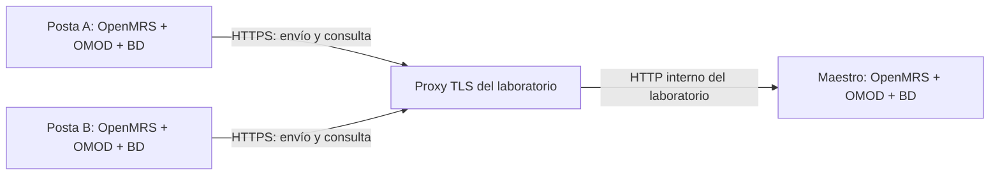
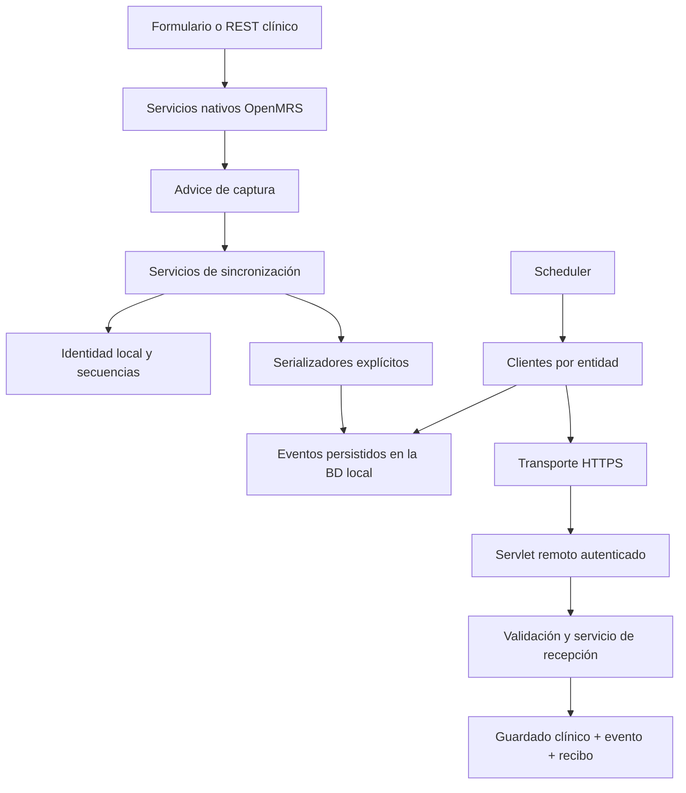

# Dossier para la redacción de los objetivos 4 y 5 de la tesis

**Proyecto:** componente de sincronización de SIH.SALUS / Microrred de Salud del Napo.  
**Fecha de corte:** 27 de septiembre de 2026, zona America/Lima.  
**Destinatarios:** autor de la tesis y Claude como apoyo de redacción.  
**Naturaleza:** insumo técnico y matriz de evidencias; no es el capítulo definitivo, una aprobación del asesor ni una certificación de cumplimiento.

**Actualización posterior a la elaboración inicial — 27/09/2026, 22:53 (Lima):** tras el arranque confirmado por el autor se verificaron, en modo de solo lectura, HTTP 200 en las tres aplicaciones y el mismo hash del OMOD final instalado. Se compararon los 14 encuentros activos del paciente ficticio y sus 55 observaciones activas: coincidieron UUID, conceptos, valores examinados, fechas y referencias a paciente, encuentro, orden y grupo. El hemograma conserva 12 resultados numéricos y su grupo; los resultados de Blood urea nitrogen conservan los valores ficticios 5 y 6, una observación por orden en cada nodo. No hay enlaces pendientes a órdenes. La propiedad de inicio del módulo es `true` en las tres bases; el autor confirmó además su estado iniciado en la interfaz. Esta revisión actualiza parcialmente LAB-17: se comprobó disponibilidad HTTP y conservación de datos; **sigue pendiente probar un evento nuevo sobre este paquete**. No se inspeccionó la representación visual del SPA ni se modificaron datos clínicos. Evidencia: [verificación tras reinicio](evidencias-tesis/2026-09-27/verificacion-datos-tras-reinicio.json). Las referencias a la verificación pendiente en el corte inicial deben leerse con esta actualización.

Este archivo es autónomo: contiene el contexto, la explicación de la implementación, el alcance vigente, los resultados disponibles, las limitaciones y las instrucciones para convertirlos en un capítulo académico. Los nombres de clases y métodos permiten localizar la evidencia en el repositorio. Los anexos finales enumeran las clases y los casos realmente ejecutados; no es necesario copiar esos inventarios completos al cuerpo de la tesis.

## 1. Lectura prioritaria para Claude

El autor necesita avanzar la redacción del **objetivo 4: implementar el componente**, aunque el desarrollo completo todavía no termina. Existe también evidencia de laboratorio que contribuye al **objetivo 5: integrarlo a SIH.SALUS**. Se puede redactar el trabajo comprobado y presentar una matriz de pendientes; no se debe escribir que se alcanzaron todos los resultados finales.

Las siguientes distinciones gobiernan todo el documento:

1. **226 pruebas aprobadas no equivalen a 100 % de requisitos implementados.** Es el resultado de una batería concreta. No es cobertura de líneas de código ni prueba de ausencia de defectos.
2. **No todas las pruebas automatizadas son unitarias.** Hay pruebas aisladas, integración con servicios OpenMRS y H2, migraciones y pruebas web con solicitudes simuladas. Las pruebas manuales con tres instancias son otra capa de integración.
3. **El laboratorio no es producción.** Se usaron instancias locales y datos ficticios. No se ha demostrado rendimiento en las postas reales ni funcionamiento bajo una conexión Starlink medida.
4. **Creación no significa toda la historia clínica.** Se implementaron pacientes, encuentros, órdenes y determinadas observaciones y relaciones. Persisten brechas para modificaciones generales, anulaciones y otros contenidos.
5. **Las referencias históricas del repositorio pueden estar desactualizadas.** Este documento diferencia expresamente avances posteriores, funciones retiradas y verificaciones pendientes.

La recomendación es redactar ahora metodología, implementación y resultados parciales verificados; dejar identificados los apartados que se actualizarán al terminar. No ocultar brechas para hacer coincidir artificialmente el resultado con el indicador esperado.

## 2. Lo que realmente establece el PDF de la tesis

Fuente proporcionada por el autor: `mario.saico.v07.tesis.sincronizacion-9-15.pdf`, extracto de siete páginas, numeradas **9 a 15 de 163**. La numeración que sigue corresponde a la página impresa de la tesis, no a la posición dentro del extracto. El archivo no incluye los capítulos completos de requisitos ni los procedimientos posteriores a la introducción de la sección 1.3.

En la página 9 se define el objetivo general como desarrollar e implantar el componente en SIH.SALUS del Hospital Santa Clotilde para sincronizar historias clínicas entre establecimientos de la microrred de Napo con conectividad intermitente. Los objetivos específicos son analizar el almacenamiento (O1), definir requisitos (O2), diseñar arquitectura y perfil funcional (O3), implementar (O4) e integrar (O5).

| Resultado | Definición en el extracto | Medio de verificación | Indicador establecido |
| --- | --- | --- | --- |
| R4.1 | Software: código fuente del componente (p. 11) | Repositorio del código fuente (p. 14, tabla 4) | Cumplimiento del **100 % de los requisitos funcionales definidos** |
| R4.2 | Informe de pruebas basadas en simulación de eventos clínicos para validar el funcionamiento (p. 11) | Informe de pruebas basadas en eventos (p. 15, continuación de tabla 4) | Índice de éxito de pruebas igual al **100 %** |
| R5.1 | Acoplamiento con la instancia principal de OpenMRS (p. 11) | Componente operativo dentro de OpenMRS (p. 15, tabla 5) | Conexión exitosa entre el componente y OpenMRS |
| R5.2 | Informe de verificación de comunicación e intercambio entre componente y OpenMRS de SIH.SALUS (p. 11) | Informe de integración (p. 15, tabla 5) | Índice de éxito de pruebas igual al **100 %** |

Los resultados de O1–O3 requieren aprobación absoluta de un especialista según las tablas de las páginas 12–14. Este dossier no acredita esas aprobaciones.

**Matiz respecto de la explicación previa de Claude:** la separación propuesta es útil para organizar la tesis, pero el PDF no dice que R4.2 sean exclusivamente pruebas unitarias ni que R5.2 se limite exclusivamente a tres nodos reales. R4.2 se define por la simulación de eventos; R5.2, por la integración e intercambio con OpenMRS. Una prueba con servicios OpenMRS/H2 ya es integración técnicamente, aunque se use como evidencia del comportamiento de R4.2. La asignación a un resultado de la tesis y el nivel técnico de una prueba son dos clasificaciones diferentes.

**Punto que debe conciliarse con el asesor:** el objetivo general menciona el hospital y R5.1 la instancia principal. El documento técnico `01_REQUISITOS_Y_ARQUITECTURA.md` distingue al maestro de la microrred del servidor propio del hospital, cuya interconexión declara fuera de alcance. No convertir esa diferencia en una conclusión implícita: explicar qué instancia constituye SIH.SALUS en la validación y confirmar el alcance final con Iván. El laboratorio local no sustituye automáticamente esa aceptación.

## 3. Estado y versión que sustentan este corte

| Elemento | Evidencia disponible |
| --- | --- |
| Revisión del repositorio inspeccionado | `83020e160c410fab4b6ebaf6d60b362926084a2e` |
| Comando de construcción vigente | `mvn clean install`, desde `synchronizationmr` |
| Última construcción conservada | BUILD SUCCESS, `2026-09-27T22:07:46-05:00` |
| Batería ejecutada | 186 casos API + 40 casos OMOD = **226**, en **23 suites con reportes** |
| Resultado | 0 fallos, 0 errores, 0 omitidos en esos reportes |
| Artefacto | `synchronizationmr/omod/target/synchronizationmr-1.0.0-SNAPSHOT.omod` |
| SHA-256 del OMOD | `EECB454C7DA80E0AB0387CCAB6BFE19F9194B1995CD5F0E84FB802C8059A8A5E` |
| Registro de construcción | `.local-sync-https/remove-native-diagnoses-build.log` |
| Despliegue documentado | Reemplazo de los tres OMOD con instancias detenidas, 27/09/2026 a las 22:12 |
| Verificación posterior pendiente | Comprobar arranque y prueba funcional breve después de retirar diagnósticos nativos |

Se volvieron a leer los XML de Surefire y a calcular el hash del OMOD para preparar este dossier. **No se volvió a ejecutar Maven ni se repitieron las pruebas del laboratorio durante su elaboración.** Las pruebas manuales descritas proceden de las bitácoras y de las confirmaciones del autor; no son observaciones nuevas de esta sesión.

La cantidad antigua de “78 pruebas” ya no describe el estado actual. Hubo una versión intermedia de 239 casos que incluía una función luego retirada; los 13 casos exclusivos de esa función también se retiraron. La batería vigente es de 226. Las dos clases vacías del arquetipo, `SynchronizationMRServiceTest` y `SynchronizationMRDaoTest`, no aportan casos ejecutados y no se cuentan como pruebas aprobadas.

Una misma versión `1.0.0-SNAPSHOT` puede corresponder a paquetes diferentes; por eso se registra hash, fecha y revisión. Los ensayos manuales anteriores deben asociarse a sus paquetes documentados, no presentarse como si todos se hubieran ejecutado sobre el último hash.

## 4. Vocabulario clínico y técnico para comprender el trabajo

| Término | Explicación para la tesis |
| --- | --- |
| Paciente / `Patient` | Ficha de una persona atendida: identidad, nombres, direcciones y otros datos admitidos. |
| Visita / `Visit` | Agrupa la atención durante un periodo. Puede contener varios encuentros. No equivale a un único formulario. |
| Encuentro / `Encounter` | Registro de una actividad de atención: signos vitales, nota de consulta o actividad asociada a órdenes. |
| Observación / `Obs` | Un dato clínico: valor numérico, texto, fecha o respuesta codificada; puede pertenecer a un grupo. |
| Orden / `Order` | Solicitud de una prestación, examen o medicamento. La solicitud y su resultado son datos distintos. |
| Resultado de laboratorio | En los flujos ensayados se almacena como observaciones asociadas a un encuentro y vinculadas a la orden. |
| Profesional / `Provider` | Registro de quien realiza o indica la atención. No es lo mismo que el usuario técnico de sincronización. |
| Catálogo / metadatos | Conceptos clínicos, ubicaciones, tipos de encuentro, medicamentos, vías, etc. Las referencias deben poder resolverse en destino. |
| UUID clínico | Identificador estable del objeto que se preserva entre bases. No es el ID numérico local ni necesariamente un hash. |
| Evento de sincronización | Mensaje persistido que describe una operación, con origen, secuencia y contenido. No equivale siempre a una entidad clínica nueva. |
| Recibo / confirmación | Registro de hasta qué secuencia consecutiva de un origen se recibió correctamente un flujo. |
| Recuperación histórica | Leer datos clínicos anteriores sin evento y preparar eventos para enviarlos. No recuperar archivos borrados ni volver a introducir resultados manualmente. |

En la interfaz se usaron formularios porque estos llaman a servicios OpenMRS que guardan encuentros y observaciones. El componente se conecta a esos servicios, no al botón ni al texto visible del formulario. Por eso un “diagnóstico” visual puede ser un grupo de observaciones o una entidad nativa Diagnosis según la configuración del formulario.

## 5. Arquitectura implementada y relación con el diseño

El producto es un **OMOD embebido en OpenMRS**, organizado en los submódulos Maven `api` y `omod`. El primero contiene captura, servicios, acceso a datos, mensajes y clientes; el segundo registra el módulo y sus servlets HTTP. No se implementó un microservicio, un servidor Spring Boot, un broker externo, SQLite ni un transporte HL7 FHIR.

La topología es centralizada: las postas inician intercambios con el maestro. El maestro conserva eventos de distintos orígenes y las postas consultan los que les faltan. La propagación desde el maestro existe mediante consulta de las postas; **no se implementó un proceso que abra conexiones push desde el maestro a cada posta**.



El proxy de ese diagrama pertenece al montaje de pruebas. No es un motor adicional de sincronización. Cada nodo mantiene su propia base. La separación de esquemas entre nodos y el transporte por aplicación son esenciales: no se replican tablas mediante una función de MariaDB.



**Correspondencia con C4:** los interceptores del diseño son clases Advice; el gestor de identificadores usa `LocalNodeService` y su DAO; el motor se reparte entre servicios, clientes y scheduler; la recepción HTTP se implementa mediante servlets. No reproducir como implementación literal las etiquetas “Spring MVC Controller” del documento inicial: los endpoints de sincronización vigentes son `HttpServlet`.

### 5.1 Captura transaccional

Al guardar un paciente, encuentro u orden admitida, el módulo detecta la operación y registra identidad, secuencia y JSON dentro de la transacción clínica. Si ocurre un fallo de captura, la operación se revierte; no se deja intencionadamente un guardado clínico sin su evento. Hay pruebas de llamadas sin transacción exterior y de rollback.

**Independencia de la red no significa ausencia absoluta de bloqueos:** guardar no hace una llamada al maestro, pero sí necesita una base local funcional, configuración válida y contenido admitido. Por ejemplo, una identidad de nodo ausente puede hacer fallar el guardado. Es incorrecto escribir que el advice “nunca puede impedir registrar”.

La recepción utiliza un ámbito de importación para evitar que los mismos datos recibidos se interpreten como altas locales y vuelvan a producir eventos de eco.

### 5.2 Identidad, secuencias e idempotencia

Se distinguen cuatro identidades: ID numérico local, UUID clínico, identidad de sincronización por origen/tipo/secuencia y UUID del evento. `server.id` identifica el origen; no se cambia libremente cuando ya existen eventos. Los contadores del nodo se protegen transaccionalmente y se prueban accesos concurrentes.

Ejemplo conceptual: `posta_a / ORDER / 3` identifica una posición del flujo de órdenes de A. El `order_id` puede ser diferente en cada base, mientras el UUID de la orden permanece igual. El número visible `ORD-5` también es local; se conserva el número fuente en el JSON, pero no se garantiza igualdad de números visibles entre instancias.

Las confirmaciones son consecutivas: recibir la secuencia 3 cuando falta la 2 no permite certificar que se recibió todo. La mayor secuencia disponible y la mayor secuencia confirmada no son intercambiables. Una repetición exacta puede confirmarse sin crear otra fila; una repetición con contenido distinto se rechaza.

Esto sustenta **reintentos con recepción idempotente**. No demuestra que la red entregue exactamente una vez. Si se pierde una respuesta después del commit remoto, el siguiente ciclo usa el estado persistido para continuar.

### 5.3 Transporte, programación y cola

Los eventos se conservan en tablas del módulo como una bandeja persistente; no en una cola únicamente en memoria. Los clientes consultan identidad/protocolo del maestro, comparan confirmaciones, envían pendientes propios y descargan otros orígenes. No envuelven la espera de red en una transacción clínica abierta.

`PatientSyncScheduler`, pese a su nombre histórico, ejecuta pacientes → encuentros → órdenes cuando se habilitan los endpoints. Usa `ScheduledExecutorService`, un trabajador y retardo fijo después de cada ciclo, no Quartz ni un scheduler de Spring por anotaciones. El valor por defecto es 60 segundos; el intervalo aceptado está entre 10 y 86400 segundos. No prometer entrega exacta cada minuto: influyen duración del ciclo, dependencias y reintentos.

El transporte exige URL HTTPS, evita credenciales embebidas en la URL, no sigue redirecciones y configura tiempos de conexión/lectura de 10/30 segundos. Detecta indisponibilidad al intentar el intercambio; no hay un servicio de ping independiente. Las páginas y lotes son acotados; no es evidencia de rendimiento a gran escala.

El orden es por origen y flujo. No hay una secuencia global única para toda la microrred ni garantía de ordenar todos los datos por fecha clínica. Una recuperación histórica puede crear hoy un evento de un encuentro de días anteriores.

### 5.4 Recepción y dependencias

La recepción valida contrato, origen, secuencia, contenido y referencias. Guarda los objetos nativos, el evento original y el recibo en una transacción. Si una dependencia o escritura falla, no confirma un éxito parcial.

Los pacientes deben existir antes que los encuentros; las órdenes requieren paciente y encuentro compatibles. Profesionales y catálogos se resuelven por UUID. No se inventan pacientes, encuentros, conceptos ni profesionales para aceptar silenciosamente mensajes incompletos.

Hay una dependencia circular entre encuentros/observaciones y órdenes. `OrderLinkDao` conserva referencias pendientes; al llegar la orden correcta las completa, validando paciente y relación. Por ello, **un encuentro confirmado puede tener relaciones de órdenes pendientes**: la comprobación de completitud debe incluir esa tabla.

Se utiliza la API clínica para guardar y JDBC limitado para relaciones o fechas que la API normaliza. Ejemplos: completar `obs.order_id` y preservar fechas originales de importación. No se debe afirmar “jamás se escribe en tablas nativas”; sí que los metadatos de sincronización se almacenan en tablas propias y no se añade un esquema de sincronización a las tablas clínicas.

## 6. Alcance clínico por flujo

### 6.1 Pacientes

Se capturan altas y se pueden preparar pacientes activos anteriores por lotes. El contrato actual incluye UUID, sexo, fecha civil de nacimiento y hora cuando aplica, información de fallecimiento, múltiples nombres, direcciones, identificadores y atributos de formatos admitidos. Se preservan campos de dirección y UUID de elementos; los atributos que referencian conceptos o ubicaciones se transmiten por UUID y se resuelven a IDs locales en destino.

Se validan formatos y catálogos; no se cargan clases Java arbitrarias recibidas en el JSON. No todos los atributos personalizados ni todas las entidades relacionadas con una persona forman parte del contrato.

Un reenvío CREATE no reescribe la ficha ya recibida ni borra una corrección local. Esto protege el historial del evento, pero **no implementa la propagación de esa corrección a otros nodos**. Las modificaciones de pacientes siguen pendientes para RF-01/RF-07.

Tampoco se identifica automáticamente que dos fichas creadas independientemente en bases diferentes representan a la misma persona. La conciliación de pacientes sin identidad compartida es un problema separado, propuesto fuera del alcance actual; debe quedar acordado formalmente, no deducirse del éxito de las pruebas de altas.

### 6.2 Encuentros, visitas y observaciones iniciales

Se capturan encuentros y observaciones con valores admitidos, grupos, referencias y metadatos. El contrato incluye una instantánea de visita cuando corresponde: puede crearla o reutilizarla validando consistencia, en lugar de dejar que un manejador automático asigne una visita diferente.

Se conservan versiones anteriores de observaciones cuando vienen en la instantánea o están disponibles en destino y cumplen las validaciones. Esto **no equivale** a capturar automáticamente cualquier corrección posterior de una observación.

Una visita activa y varios encuentros son entidades distintas. La visita se transporta en el contexto del encuentro, no mediante un flujo independiente de altas/cierres. No se ha implementado sincronización general de cierre o edición de visitas.

Los archivos de observaciones complejas, condiciones y diagnósticos nativos no quedan cubiertos por una afirmación general de “encuentro completo”. El serializador marca contenido no admitido y el receptor lo rechaza; este control evita pérdidas silenciosas, pero también puede bloquear un evento que utilice funciones fuera del contrato.

### 6.3 Órdenes

Se soporta creación de órdenes nativas admitidas, incluidas órdenes base, de medicamento y de examen. Se transmiten referencias a paciente, encuentro, profesional, concepto, tipo y ámbito de atención, además de campos propios como dosis, vía, frecuencia, cantidad, duración, instrucciones y fechas según el tipo.

En OpenMRS una revisión o suspensión puede crear una **nueva fila** con acción `REVISE` o `DISCONTINUE` y referencia a la anterior. El módulo puede transportarla como CREATE de esa nueva fila. Existen pruebas de recepción de revisión y suspensión. Esto no demuestra sincronización general de todos los cambios de una orden existente, ni que cualquier botón “Cancel order” quede cubierto en todas las versiones de la interfaz.

La importación respeta las validaciones nativas. Los grupos de órdenes, clases de órdenes personalizadas y dosificaciones fuera de los formatos admitidos no se consideran resueltos.

### 6.4 Resultados añadidos después de crear el encuentro

El primer ensayo de hemograma mostró una brecha real: la orden se distribuía, pero los resultados guardados después no estaban en el CREATE original del encuentro. Se añadió la operación **ADD_OBS** para observaciones nuevas de un encuentro ya publicado.

`ObservationAdditionAdvice` intercepta guardados de observaciones; `EncounterCreationAdvice` también puede detectar incorporaciones al guardar encuentros existentes. `ObservationCaptureScope` evita capturas parciales en llamadas anidadas y permite publicar grupos completos. Se comparan UUID publicados para no emitir nuevamente observaciones conocidas.

El evento de adición utiliza el flujo y las confirmaciones de encuentros, con una tabla adicional. Conserva el CREATE original. Por tanto, ahora **número de eventos de encuentros y número de encuentros clínicos pueden ser diferentes**.

Se conservan grupos nuevos, hijos de grupos existentes y vínculos con órdenes. Se validan conflictos y dependencias; los reintentos no duplican resultados. Cuando falta un encuentro o grupo de otro origen, el cliente puede continuar con otros orígenes y reintentar la dependencia después.

En términos funcionales, añadir un resultado amplía la atención. En el modelo sincronizado actual crea observaciones nuevas; no es un UPDATE genérico de la orden. El estado `fulfillerStatus`, correcciones con `previousVersion`, anulaciones y archivos complejos siguen fuera de este flujo de adición.

### 6.5 Recuperación de datos anteriores

Hay preparación explícita por lotes de pacientes, encuentros y órdenes que ya existían sin eventos. La selección de órdenes respeta dependencias con órdenes anteriores, incluso cuando sus IDs locales no reflejan ese orden. Ciclos o referencias bloqueadas no se presentan falsamente como carga terminada.

Para resultados históricos se añadió `prepareExistingObservations(afterEncounterId, limit)`. Recorre encuentros activos ya publicados y compara observaciones originales activas con los UUID de CREATE/ADD_OBS. Publica las que faltan sin volver a guardar datos clínicos ni reemplazar eventos antiguos.

Se habilita expresamente y requiere preparación de pacientes, encuentros y órdenes. El cursor de resultados está en memoria; avanza tras confirmar cada lote. Al reiniciar puede volver a recorrer desde el inicio: la deduplicación por eventos evita republicar los mismos resultados. “Recuperó otra vez” significa que volvió a **revisar**, no que creó copias nuevas.

El límite de 1–100 para este barrido cuenta encuentros, no observaciones individuales. No se implementó un detector universal de primera instalación, una marca persistente de carga inicial concluida ni una ventana nocturna automática. Activación sin reinicio, cargas masivas y concurrencia entre carga inicial y nuevas dependencias requieren trabajo adicional.

### 6.6 Diagnósticos, profesionales y formularios: decisiones vigentes

La sincronización de `Diagnosis` nativo se implementó experimentalmente y **se retiró por decisión del autor** hasta definir el flujo de captura que la necesita. Ya no están `DiagnosisCreationAdvice`, `EncounterDiagnosisSnapshot` ni ADD_DIAGNOSES/esquema 5. No describirlos como producto entregado.

El formulario Structured SOAP utilizado registra “Malaria” mediante un grupo de `Obs`. Ese grupo sí se sincronizó. No hay contradicción: dato clínico de diagnóstico y entidad nativa Diagnosis son representaciones distintas.

Para las pruebas se configuró manualmente un Provider con identidad compatible en las tres instancias. **No fue una sincronización automática de profesionales.** La necesidad real es poder resolver la referencia del profesional de origen; no obliga a que ese médico trabaje físicamente en todas las postas ni a darle acceso como usuario en todas ellas.

Preguntas pendientes para Iván: ¿existirá un catálogo compartido de profesionales?, ¿quién asigna y conserva sus UUID?, ¿se replicarán referencias de profesionales externos o se aprovisionarán previamente?, ¿quién gestiona bajas y cambios?, ¿cuál será la distribución ligera de las postas? También debe inventariarse qué guardan realmente los formularios SIH.SALUS. Cambiar únicamente etiquetas suele ser independiente del motor; introducir entidades, atributos o catálogos nuevos puede exigir ampliar el contrato y las pruebas.

## 7. Persistencia y contratos de intercambio

Migraciones: `synchronizationmr/api/src/main/resources/liquibase.xml`. Configuración de beans: `moduleApplicationContext.xml` en ese mismo directorio. Registro del módulo: `synchronizationmr/omod/src/main/resources/config.xml`.

| Tabla propia | Función |
| --- | --- |
| `synchronizationmr_local_node` | Identidad estable y contadores por flujo |
| `synchronizationmr_patient_identity` | Asociación paciente local, UUID, origen y secuencia |
| `synchronizationmr_patient_event` | Evento original de creación de paciente y JSON |
| `synchronizationmr_patient_receipt` | Confirmación consecutiva de pacientes por origen |
| `synchronizationmr_encounter_event` | CREATE de encuentro, identidad y JSON |
| `synchronizationmr_encounter_addition` | Eventos de incorporación de observaciones a encuentros |
| `synchronizationmr_encounter_receipt` | Confirmación del flujo combinado de encuentros |
| `synchronizationmr_order_event` | Eventos de órdenes, identidad y JSON |
| `synchronizationmr_order_receipt` | Confirmación consecutiva de órdenes por origen |
| `synchronizationmr_order_link` | Referencias a órdenes pendientes de completar |
| `synchronizationmr_item` | Tabla del arquetipo; no es la cola clínica implementada |

Los mensajes son JSON explícitos y versionados, no una serialización indiscriminada de objetos Hibernate. El sobre identifica `schemaVersion`, `eventUuid`, `originServerId`, `entityType`, `entitySequence`, `operation`, `occurredAt` y `payload`. La fecha del evento no debe confundirse con fecha del encuentro o del resultado.

| Flujo | Contrato vigente |
| --- | --- |
| Paciente CREATE | Emisión de esquema 4; compatibilidad de recepción con esquema 3 documentada y probada |
| Encuentro CREATE | Esquema 3; recepción de esquema 2 sin visita conservada |
| Encuentro ADD_OBS | Esquema 4 |
| Orden CREATE | Esquema 1; acción nativa dentro del contenido |

El número de versión se interpreta dentro del flujo; no significa que todos los tipos compartan exactamente el mismo esquema. Se rechazan contenido desconocido, referencias incorrectas y eventos incompatibles. Un evento antiguo sin JSON no se reconstruye desde el estado clínico actual como si fuera el original: se requiere revisión.

Los endpoints son `/openmrs/moduleServlet/synchronizationmr/patientSync`, `encounterSync` y `orderSync`. Usan recursos por parámetros: `node`, `origins`, `status`, `events` y `receive`; lectura GET y recepción POST. Las páginas consultan eventos posteriores a una secuencia. **No se identificó un recurso remoto dedicado a buscar una única entidad por identidad de sincronización**, por lo que RF-14 requiere completar o acordar expresamente su criterio, en lugar de declararlo cumplido por tener paginación.

## 8. HTTPS, autenticación y despliegue

### 8.1 Entorno utilizado

| Elemento | Configuración documentada |
| --- | --- |
| Proyecto | Maven, submódulos API/OMOD, paquete `org.openmrs.module.synchronizationmr` |
| API de compilación y pruebas OpenMRS | 2.4.2 según POM |
| Plataforma del laboratorio | 2.8.10-SNAPSHOT; distribución 3.8.0-SNAPSHOT según bitácora |
| Compilador | Objetivo de bytecode Java 8; ejecución de laboratorio con JDK 21 |
| Pruebas | JUnit, Mockito, contexto OpenMRS/H2, Surefire 3.2.5 en el perfil de JDK moderno |
| JSON | Jackson, dependencia proporcionada por OpenMRS |
| Maestro | SDK `microrred_maestro`, HTTP local 8080 |
| Posta A / B | SDK `posta_a` / `posta_b`, HTTP local 8081 / 8082 |
| Bases de laboratorio | Tres contenedores MariaDB separados, puertos locales 3306/3307/3308 |
| Canal de sincronización | Nginx `sihsalus_https`, HTTPS local 8443 hacia maestro |

Las diferencias entre la API de compilación y la plataforma ejecutada deben declararse. Una validación en esas versiones no demuestra compatibilidad con todas las distribuciones OpenMRS. El POM mantiene metadatos del arquetipo; no usar su URL SCM de ejemplo como dirección real del repositorio de tesis sin confirmarla.

### 8.2 Qué se configuró y qué demuestra

En `dev/https/nginx.conf`, Nginx acepta TLS 1.2/1.3 y publica únicamente las rutas de los tres endpoints; las demás devuelven 404. El límite de cuerpo del proxy es 10 MB. Se utilizó certificado local y almacén de confianza Java, conservando la validación de certificado y nombre del host; no una política de aceptar cualquier certificado.

El cliente utiliza autenticación Basic dentro de HTTPS. La aplicación comprueba contexto seguro, autenticación, privilegios e identidad/rol del par. El rol técnico `Sincronizacion Microrred` recibe los privilegios propios `Prepare Synchronization Records`, `View Synchronization Records`, `Receive Synchronization Records` y los permisos nativos necesarios para cada operación.

Los roles de nodo se configuran mediante `synchronizationmr.nodeRole` (`POSTA`/`MASTER`), la identidad mediante `server.id` y la programación mediante variables de entorno. Registrar privilegios en el OMOD no equivale por sí solo a aprovisionar todos los usuarios, roles y asignaciones de cualquier instalación nueva. La configuración técnica del laboratorio debe distinguirse del comportamiento automático del módulo.

TLS termina en Nginx y el salto al maestro local es HTTP. La configuración de proxy/Tomcat debe confiar solo en el intermediario previsto para interpretar la conexión original como segura. No afirmar cifrado de extremo a extremo en todos los segmentos ni seguridad de producción completa; los puertos HTTP de laboratorio y los encabezados de proxy requieren una arquitectura de despliegue definida.

Los logs evitan imprimir excepciones que pudieran contener datos clínicos o credenciales; el proxy tiene access log desactivado. Esto **no resuelve RF-15**: falta justificar una auditoría por transacción, destino y resultado. No confundir reducción de datos sensibles en logs con auditoría completa.

### 8.3 Construcción y configuración reproducible

```powershell
# Desde la carpeta synchronizationmr:
mvn clean install
```

Revisar BUILD SUCCESS y todos los reportes API/OMOD. El resultado instalable es el OMOD de `omod/target`. `install` también publica el artefacto en el repositorio Maven local, que utiliza el SDK. Construir, instalar en Maven y desplegar en cada OpenMRS son pasos relacionados pero diferentes; el hash permite comprobar qué paquete se copió.

No usar las antiguas instrucciones de `.build-sync` ni `isolated-sync-build`: fueron retiradas. Se conservan en bitácoras como historial de una incidencia de compilación, no como procedimiento vigente. La hipótesis de interferencia IDE/Maven no debe redactarse como causa demostrada de todos los problemas de construcción.

Arranque de laboratorio, **documentación para reproducir, no ejecución realizada al elaborar este archivo**:

```powershell
# Desde synchronizationmr, terminal del maestro:
mvn openmrs-sdk:run -DserverId=microrred_maestro

# Desde la raíz del repositorio, en terminales separadas:
.\dev\https\Start-Posta.ps1 -ServerId posta_a -SincronizarPacientes -SincronizarEncuentros -SincronizarOrdenes
.\dev\https\Start-Posta.ps1 -ServerId posta_b -SincronizarPacientes -SincronizarEncuentros -SincronizarOrdenes
```

Esto presupone bases, proxy, certificados, usuarios e instancias SDK ya configurados. La recuperación histórica es una activación adicional, no necesaria en cada arranque normal. Las variables relevantes son `SYNCMR_ENABLED`, `SYNCMR_INTERVAL_SECONDS`, `SYNCMR_MASTER_ENDPOINT`, `SYNCMR_MASTER_ENCOUNTER_ENDPOINT`, `SYNCMR_MASTER_ORDER_ENDPOINT`, `SYNCMR_MASTER_SERVER_ID` y las de preparación. Las credenciales se proporcionan por el mecanismo local y **no deben aparecer en la tesis ni en capturas**. No adjuntar claves privadas, archivos de secretos ni configuraciones completas con contraseñas.

Detener el proxy simula indisponibilidad del canal; detener OpenMRS B simula un destino desconectado; desactivar temporalmente el módulo para generar registros anteriores simula una instalación que ya tenía datos. Son pruebas diferentes. El usuario no tendrá que detener continuamente la atención para que la sincronización normal funcione. El procedimiento administrativo de instalación/carga inicial en producción sigue por definir.

## 9. Qué clases explicar en el capítulo y cómo se relacionan

No conviene dedicar un párrafo a cada clase en el cuerpo del capítulo. Explicar responsabilidades, flujo de datos y decisiones; utilizar la siguiente tabla y el inventario final como anexo de trazabilidad.

| Grupo / clases centrales | Responsabilidad y relación |
| --- | --- |
| `PatientCreationAdvice`, `EncounterCreationAdvice`, `OrderCreationAdvice`, `ObservationAdditionAdvice` | Interceptan operaciones de servicios y llaman a captura; no envían datos por red durante el guardado clínico. |
| `LocalNodeService` / `LocalNodeServiceImpl` / `LocalNodeDao`, `ServerId` | Validación y conservación del origen, acceso transaccional a identidad y contadores. |
| `PatientSyncService`, `EncounterSyncService`, `OrderSyncService` y sus `Impl`/DAO | Captura, preparación de históricos, consulta de eventos y secuencias. |
| `PatientCreationPayloadSerializer`, `EncounterCreationPayloadSerializer`, `OrderCreationPayloadSerializer` | Instantáneas JSON explícitas, conservación de referencias y control del contenido admitido. |
| `PatientAttributeValues`, `EncounterVisitSnapshot`, `EncounterObservationVersions`, `OrderPayload` | Reglas específicas de atributos, visitas, versiones y campos de órdenes. |
| `PatientIncomingEvent`, `EncounterIncomingEvent`, `OrderIncomingEvent`, `EventJson` | Interpretación y validación de mensajes antes de importar. |
| Servicios `PatientReceiveService`, `EncounterReceiveService`, `OrderReceiveService` y sus `Impl`/DAO | Recepción atómica, comprobación de duplicados/conflictos y avance de recibos. |
| `IncomingPatientSave`, `IncomingEncounterSave`, `IncomingOrderSave`, `ObservationCaptureScope` | Guardado nativo y control del ámbito de captura/importación. |
| `OrderLinkDao` | Registro y resolución de referencias pendientes a órdenes sin crear sustitutos ficticios. |
| `EncounterEventStream`, `ObservationPreparationBatch`, `EncounterDependencyException` | Flujo CREATE/ADD_OBS combinado, avance del barrido y dependencia recuperable. |
| `PatientSyncClient`, `EncounterSyncClient`, `OrderSyncClient` | Un ciclo de comparación, envío, descarga y reanudación por entidad. |
| `PatientRemoteTransport`, `PatientHttpsTransport` | Abstracción de transporte para probar clientes y conexión HTTPS real reutilizable. |
| `PatientSyncScheduler`, `PatientSyncScheduleConfig`, `PatientPreparationScheduler` | Programación, activación explícita, validación de configuración y preparación por lotes. |
| `PatientSyncHttpServlet`, `EncounterSyncHttpServlet`, `OrderSyncHttpServlet`, `PatientSyncPeerSession` | Endpoints, autenticación del par y delegación hacia servicios. |
| `SynchronizationMRActivator` | Inicio y parada de trabajadores con el ciclo de vida del OMOD. |
| `PatientSyncRecord`, `PatientSyncEvent`, `EncounterSyncEvent`, `OrderSyncEvent` | Objetos de identidad/eventos usados entre capas; no sustituyen entidades clínicas. |

Piezas heredadas del arquetipo (`SynchronizationMR`, servicio/DAO/controlador de ejemplo) no deben atribuirse como mecanismos clínicos construidos para esta solución. `SynchronizationMRConfig` y los recursos Spring/configuración forman parte del montaje, pero el flujo principal es el descrito arriba.

## 10. Pruebas automatizadas: interpretación y evidencia

### 10.1 Capas de prueba

| Capa | Qué verifica | Qué no demuestra por sí sola |
| --- | --- | --- |
| Aislada: advice, serializadores, clientes y scheduler con dobles | Decisiones, campos, reintentos, rechazo de errores, programación | Persistencia en la versión MariaDB del laboratorio o una conexión TLS real |
| Integración OpenMRS/H2 | Servicios, interceptores, transacciones, filas, relaciones, rollback e idempotencia | Toda la configuración de una distribución SIH.SALUS desplegada |
| Migración Liquibase/H2 | Instalación, conservación de identidad y rechazo de migraciones incompatibles | Actualización de todas las bases históricas posibles |
| Web con solicitudes/respuestas simuladas | Enrutamiento, autorización y respuestas; algunas pruebas incluyen contexto OpenMRS | Handshake TLS o comportamiento de Nginx por el nombre “HttpIntegration” |
| Laboratorio con tres instancias | Recorrido por interfaz, servicios, BD, HTTPS y redistribución entre nodos | Operación de campo, carga real o todos los casos clínicos |

`PatientSyncHttpIntegrationTest` usa contexto OpenMRS y `MockHttpServletRequest/Response`; no abre por ello un servidor HTTPS real. En los POM aparece JUnit 4 como dependencia gestionada y hay pruebas que importan JUnit Jupiter, como `NodeIdentityMigrationTest`: describir la batería como JUnit/Surefire y no atribuirla exclusivamente a una sola generación sin revisar el árbol completo de dependencias.

La clasificación de las suites del corte suma 65 casos aislados o con dobles, 122 con contexto OpenMRS/H2, 3 de migraciones Liquibase/H2 y 36 web con dobles. Dentro de los 122 se incluyen los cuatro casos web que sí utilizan contexto OpenMRS. Es una clasificación por entorno de ejecución, no una medición de cobertura.

### 10.2 Evidencias de comportamiento particularmente relevantes

| Propiedad | Ejemplo de método realmente ejecutado | Interpretación |
| --- | --- | --- |
| Atomicidad del alta | `PatientCaptureIntegrationTest.rollbackRemovesPatientIdentityEventAndCounterIncrement` | Un rollback revierte paciente, identidad, evento y avance de contador. |
| Concurrencia | `PatientCaptureIntegrationTest.simultaneousClinicalTransactionsAllocateDifferentSequences` | Altas concurrentes no reciben la misma secuencia en el escenario ensayado. |
| Confirmación sin saltos | `PatientReceiveIntegrationTest.cannotConfirmThreeWhenTwoIsMissing` | No se confirma una secuencia que oculte un evento faltante. |
| Duplicados concurrentes | `PatientReceiveIntegrationTest.simultaneousDuplicateDeliveryCreatesSingleRecord` | La recepción simultánea repetida crea una sola ficha en el ensayo. |
| Conservación de datos | `PatientReceiveIntegrationTest.preservesAllAddressFieldsAndMultipleNamesAfterDatabaseReload` | Verifica valores después de recargar desde la base, no solo objetos en memoria. |
| Respuesta perdida | `PatientSyncClientTest.lostAcknowledgementResumesFromMastersPersistedConfirmation` | La confirmación persistida permite reanudar sin recrear datos. |
| Visita correcta | `EncounterReceiveIntegrationTest.importKeepsExplicitVisitInsteadOfReplacingItWithLocalAutomaticVisit` | La importación conserva la asociación recibida. |
| Dependencia circular | `OrderReceiveIntegrationTest.persistsDeferredObservationLinkAndCompletesItWhenOrderArrives` | El vínculo pendiente se resuelve al recibir la orden. |
| Históricos por dependencia | `OrderPreparationIntegrationTest.preparesPredecessorBeforeDependentEvenWhenItsLocalIdIsHigher` | La selección no presupone que el ID local ordene las dependencias. |
| Resultados e idempotencia | `EncounterAdditionIntegrationTest.receivesGroupWithOrderLinkAndRetriesWithoutEchoOrDuplicates` | Conservación del grupo, vínculo y ausencia de duplicación/eco. |
| Recuperación repetida | `EncounterAdditionIntegrationTest.preparesHistoricalResultsWithoutChangingClinicalRowsAndRescansWithoutDuplicates` | Publicación histórica sin recreación clínica y repetición segura del barrido. |
| Reintento periódico | `PatientSyncSchedulerTest.failedCycleDoesNotCancelNextAttempt` | Un fallo no elimina la ejecución futura del trabajador. |

El anexo registra los 226 nombres, suite, resultado y fuente. El nombre de un caso ayuda a ubicarlo; para redactar un procedimiento detallado hay que leer sus preparaciones y aserciones. No convertir cada método en una supuesta prueba manual.

### 10.3 Cálculo de indicadores

Para la ejecución conservada: `éxito de la batería ejecutada = 226 / 226 × 100 = 100 %`, con cero omitidos. Esta frase es válida **limitada a esa ejecución y a esos casos**. No significa que se haya diseñado y ejecutado toda la batería final requerida para R4.2.

Para R4.1, el denominador funcional disponible es 16 requisitos del documento técnico. Se propone calcular al cierre: `requisitos funcionales aceptados íntegramente / 16 × 100`. La matriz siguiente es preliminar y no adjudica aceptación definitiva; no se calcula un porcentaje de cumplimiento inventado ni se cuentan requisitos parciales como completos. Los cinco RNF se reportan adicionalmente, sin mezclarlos con el denominador que el PDF define como funcional.

Cobertura de requisitos = tener casos trazados para criterios de aceptación; éxito de pruebas = casos ejecutados que pasan; cobertura de código = líneas/ramas medidas por instrumentación. Son magnitudes diferentes. En los POM revisados no se configuró una medición JaCoCo; no existe aquí un porcentaje de cobertura de líneas o ramas para citar.

Para R5.2 se necesita un plan cerrado con casos y resultados reproducibles sobre la versión elegida. No calcular un 100 % contando únicamente los ensayos exitosos relatados e ignorando pendientes o la brecha de estado de órdenes.

## 11. Matriz preliminar de trazabilidad de requisitos

Fuente de los requisitos: `01_REQUISITOS_Y_ARQUITECTURA.md`. El PDF aportado define indicadores, pero no trae el texto completo de los 16 RF/5 RNF. Se debe contrastar esta lista con el documento formal aprobado de O2 antes de cerrar la tesis.

Estados: **base implementada** = mecanismo existente con evidencia, aceptación final por concretar; **parcial** = brecha identificada frente al requisito; **pendiente de validación** = falta evidencia suficiente del atributo completo. No son actas de aceptación.

| ID | Requisito resumido | Estado y soporte | Brecha / criterio necesario para cierre |
| --- | --- | --- | --- |
| RF-01 | Detectar creación o modificación de paciente, encuentro u orden | **Parcial.** Advice de altas y ADD_OBS; pruebas de captura/recepción. | Implementar y probar modificaciones acordadas. No basta probar que editar no crea otra alta. |
| RF-02 | Identificador secuencial propio del origen | **Base implementada.** LocalNode/DAO y pruebas concurrentes. | Explicitar separación identidad de entidad/secuencia de evento, especialmente ADD_OBS y futuras ediciones. |
| RF-03 | Asociación interna sin alterar tablas nativas | **Base implementada respecto del esquema.** Tablas propias Liquibase, pruebas transaccionales. | Acordar que “no alterar” se refiere al esquema; hay escrituras clínicas y ajustes JDBC limitados documentados. |
| RF-04 | Configurar rol posta/maestro | **Base implementada.** Propiedad de rol, server.id, validación de pares. | Manual de aprovisionamiento y prueba final con distribución real; no hay interfaz administrativa nueva. |
| RF-05 | Comparar periódicamente identificadores | **Base implementada.** Clientes, recibos y scheduler; pruebas de saltos y reanudación. | Formalizar comparación por origen/flujo, no por un contador global. |
| RF-06 | Solicitar y recibir faltantes conservando origen | **Base implementada en contratos admitidos.** Recepción transaccional y ensayos multinodo. | Completar alcance de entidades/metadatos y dependencia; historial fuera de contrato no se acepta silenciosamente. |
| RF-07 | Enviar nuevos o modificados | **Parcial.** Altas, adiciones y nuevas filas de órdenes. | Cambios generales y estados posteriores aún no tienen flujo completo. |
| RF-08 | Propagar maestro → postas | **Base implementada.** Consulta de otros orígenes por las postas; ensayos A→M→B y B→M→A. | Documentar que es pull; validar topología final y todos los orígenes requeridos. |
| RF-09 | Confirmar recepción y almacenamiento | **Base implementada.** Recibo atómico y reintentos idempotentes. | Distinguir confirmación del evento de resolución de todas sus relaciones de órdenes. |
| RF-10 | Detección periódica de conectividad | **Parcial respecto de una interpretación estricta.** Intentos, timeouts y reintentos. | Acordar si intento de sincronización satisface el requisito o se requiere detector/estado independiente. |
| RF-11 | Registrar sin conexión | **Base implementada para fallo remoto.** Captura local sin red, pruebas con HTTPS detenido. | No confundir con disponibilidad ante BD/configuración inválida; ensayar condiciones de campo. |
| RF-12 | Cola diferida y orden cronológico | **Parcial respecto de cronología global.** Persistencia y secuencias por origen/tipo. | Definir cronología exigida: captura, dependencia o fecha clínica; no hay orden total de todos los nodos. |
| RF-13 | Procesar pendientes y reintentar | **Base implementada.** Reanudación por recibos y ensayos de reconexión. | Cierre de casos de bloqueo persistente, dependencia y carga inicial concurrente. |
| RF-14 | Consultar entidad por ID de sincronización | **Parcial.** Páginas de eventos, estados y consultas internas por UUID. | API o contrato explícito de consulta exacta entre nodos y sus pruebas; no adjudicarlo a la paginación. |
| RF-15 | Auditoría por transacción: origen, destino, fecha, entidad, resultado | **Parcial.** Eventos y recibos conservan trazabilidad básica. | Registro verificable por destino/intento/resultado, política de retención y protección; los logs actuales no lo cubren íntegramente. |
| RF-16 | Cifrado y autenticación | **Implementado y probado parcialmente en laboratorio.** HTTPS, Basic, privilegios e identidad. | Arquitectura segura final, confianza en proxy, credenciales y validación negativa TLS; no afirmar cifrado de cada segmento actual. |
| RNF-01 | Disponibilidad local sin conexión | **Base implementada y ensayada ante fallo remoto.** | Pruebas operativas en entorno objetivo; no garantiza disponibilidad absoluta. |
| RNF-02 | Ligereza, módulo sin servicio adicional | **Base implementada como OMOD.** Sin motor externo de sincronización. | Conciliar uso de infraestructura TLS/proxy con el texto estricto del requisito y distribución de postas. |
| RNF-03 | Sin degradación perceptible | **Pendiente de validación cuantitativa.** Límites y trabajador controlado son decisiones de diseño. | Medir latencia de registro, CPU, memoria, crecimiento de eventos y recuperación de atrasos con y sin módulo. |
| RNF-04 | Integrarse a distribución SIH.SALUS | **Parcialmente validado.** Paquete y laboratorio OpenMRS. | Distribución final, módulos, catálogos y formularios reales del hospital/postas todavía por confirmar. |
| RNF-05 | Preservar historial de encuentros/órdenes | **Base implementada en escenarios admitidos.** JSON inmutable, rechazos y conservación de versiones. | Revisión/suspensión nativa cambia estado de la anterior; precisar integridad histórica sin prometer inmutabilidad física de toda fila. |

No cambiar los requisitos para que encajen con lo ya programado sin aprobación del proceso de tesis. Priorizarlos por fases tampoco elimina RF-01/RF-07 del compromiso final.

## 12. Ensayos del laboratorio: evidencia aprovechable para O5

Fuentes: `dev/https/README.md`, documentos 25–27 y conversación del autor. Los documentos contienen secuencias históricas; un “pendiente” inicial puede tener un resultado posterior. Se consignan los resultados más recientes localizados. Las capturas insertadas en la conversación no se han exportado automáticamente como archivos de evidencia en este dossier.

**Actualización documental del 29/09/2026:** se completó LAB-01 a partir de los resultados registrados el 21/09/2026 en la bitácora HTTPS. La creación de pacientes, la preparación de pacientes existentes y la recuperación tras detener HTTPS **ya fueron probadas con resultado satisfactorio en los escenarios descritos**. La anterior indicación de “completar ficha” señalaba una omisión de detalle en este dossier, no pruebas sin realizar. No se repitieron los ensayos ni se encendieron instancias para esta actualización. Se desglosa LAB-01 en tres subcasos, conservando los demás identificadores.

| Caso propuesto para informe | Procedimiento registrado | Resultado documentado / límite |
| --- | --- | --- |
| LAB-01a Creación de pacientes | Crear pacientes desde A, B y maestro; comprobar su distribución y una segunda alta local en A | **Completado el 21/09/2026.** Cuatro pacientes con UUID distintos por base al finalizar estas altas; coincidencia de campos y JSON, conservación de origen y avance de recibos. Detalle en §12.0. |
| LAB-01b Paciente creado con HTTPS detenido | Detener solo `sihsalus_https`, crear paciente en A y reactivar el proxy | **Completado el 21/09/2026.** Durante el corte: A=5 pacientes, maestro/B=4; después: cinco por base, sin duplicados, y recibos de A avanzan de 2 a 3 sin volver a guardar. |
| LAB-01c Preparación de pacientes existentes | Registrar tres pacientes con el módulo inactivo en A; habilitar preparación de tamaño 2 y transporte | **Completado el 21/09/2026.** Lotes de dos y uno a las 13:35:31 y 13:36:31; ocho pacientes y ocho eventos por base al finalizar, sin duplicados; maestro/B confirman A=6. |
| LAB-02 Signos vitales desde A | Guardar signos vitales en el paciente ficticio; revisar maestro/B | Encuentro y observaciones verificados, usuario confirmó las tres pantallas; bitácora HTTPS. |
| LAB-03 SOAP desde B | Configurar Provider compatible y guardar SOAP | Encuentro B→maestro→A y JSON coincidente documentados. La preparación del Provider fue manual. |
| LAB-04 Structured SOAP desde maestro | Registrar consulta y recibirla en ambas postas | Recepción y confirmaciones documentadas. |
| LAB-05 Encuentro con HTTPS detenido | Mantener atención local, guardar y restaurar proxy | Recuperación sin volver a guardar el formulario. Simula caída del canal, no todos los fallos de red. |
| LAB-06 Encuentros anteriores al módulo | Crear tres notas con módulo desactivado y luego preparar por lotes | Ocho encuentros/eventos en el estado de ese ensayo; incorporación de tres notas y doce observaciones documentada. Los conteos son históricos. |
| LAB-07 Orden de examen desde A | Complete blood count, firmar y cerrar cesta | Orden, encuentro y relaciones recibidos en las tres bases. |
| LAB-08 Orden de medicamento desde B | Paracetamol 500 mg en paciente ficticio | Orden y campos de dosificación comparados en tres instancias. No es recomendación terapéutica. |
| LAB-09 Orden desde maestro | Blood urea nitrogen | Recepción en A/B conservando identidad y referencias. |
| LAB-10 Orden durante caída HTTPS | Crear orden con referencia `PRUEBA-A-OFFLINE-001` y restaurar proxy | Una copia por nodo, misma identidad/JSON y avance de recibos. |
| LAB-11 Órdenes históricas por lotes | Tres órdenes con módulo inactivo, después preparación de tamaño 2 | Primer lote de dos y siguiente de uno; ocho órdenes/eventos en cada base en ese momento. |
| LAB-12 Resultado nuevo ORD-5 | Añadir valor ficticio 5 de Blood urea nitrogen | ADD_OBS y una observación por nodo; confirmado visualmente en los tres. Estado de cumplimiento no se propagó íntegramente. |
| LAB-13 Recuperación de hemograma ORD-1 | Preparar resultados que solo existían en A | Trece observaciones (12 valores + grupo) en los tres nodos, UUID y hash coincidentes. |
| LAB-14 Repetición de recuperación | Reiniciar A con barrido histórico activado | Cursor vuelve a avanzar; permanece un único evento de adición y 13 observaciones para ese ensayo. |
| LAB-15 Resultado con B detenida | Guardar en A valor ficticio 6 de ORD-4, luego arrancar B | A/maestro lo conservan mientras B está detenida; B lo recibe luego sin duplicados, confirmado visualmente. |
| LAB-16 Diagnóstico visual como Obs | Structured SOAP con Malaria, certeza y prioridad | Se sincroniza un grupo Obs; cero diagnósticos nativos. No prueba la función retirada de Diagnosis. |
| LAB-17 Regresión tras retirada de Diagnosis | Arrancar los tres OMOD del hash final y comprobar funcionamiento básico | **Pendiente de registrar al corte.** La compilación aprobada no sustituye este ensayo. |

Los IDs LAB anteriores se proponen para ordenar la evidencia; no son nombres de una batería manual que ya estuviera formalizada ni justifican un porcentaje global de aprobación. Cuando una ficha no tenga dato verificable, marcar “por completar” en lugar de reconstruirlo de memoria.

### 12.0 Fichas documentales de pacientes: LAB-01a, LAB-01b y LAB-01c

Estas fichas organizan evidencia histórica ya registrada, no un nuevo plan pendiente de ejecución. Fuente principal: [bitácora HTTPS](dev/https/README.md), apartados **“Resultado observado el 21/09/2026”** y **“Preparación de pacientes existentes (prueba completada)”**. Los conteos siguientes corresponden a cada momento del ensayo y no se presentan como conteos actuales del laboratorio.

#### LAB-01a — Creación y distribución desde los tres orígenes

**Propósito y requisitos relacionados:** comprobar captura de altas, identidad, transporte, recepción y propagación (RF-01 en su parte de creación; RF-02, RF-03, RF-06, RF-07 en su parte de altas, RF-08 y RF-09).

**Entorno y precondiciones:** tres instancias con bases independientes, identidades de nodo distintas, cuentas técnicas y canal HTTPS configurados. Los pacientes son ficticios. La bitácora registra una corrección previa de configuración CSRF del maestro para permitir los POST autenticados de sincronización; no se omite esa incidencia ni se supone que el primer intento funcionó antes del ajuste.

**Procedimiento y resultados observados:**

| Paso | Registro de origen | Resultado documentado |
| --- | --- | --- |
| 1 | Primer paciente creado mediante SPA en A; origen `posta_a`, secuencia 1 | Una ficha por base; mismo UUID de paciente y evento, campos y hash del JSON. Maestro y B confirman A=1. Los IDs numéricos locales son A=4, maestro=5 y B=4, demostrando que no se depende de su igualdad. |
| 2 | Paciente distinto creado en B; origen `posta_b`, secuencia 1 | Llega al maestro y a A; dos pacientes por base. Maestro y A confirman B=1. Coinciden UUID, fecha, dirección y hash JSON; el primer paciente no se duplica. |
| 3 | Paciente creado en maestro; identificador clínico `1100000W`, origen `microrred_maestro`, secuencia 1 | Ambas postas lo descargan y confirman. Tres pacientes con tres UUID distintos por base y contenido coincidente. |
| 4 | Segundo paciente local de A; identificador `2100002N`, origen `posta_a`, secuencia 2 | Maestro y B confirman A=2. Cuatro pacientes con cuatro UUID distintos por base. La secuencia de A avanza por su alta local, sin contar como propias las fichas importadas. |

Antes del paso 3 se ajustaron los generadores de identificadores clínicos del laboratorio: prefijos 1 para maestro, 2 para A y 3 para B, longitud 8. Se conservaron identificadores existentes y no se reiniciaron contadores. Esta configuración de IDGen es diferente de la identidad de sincronización y del UUID clínico.

**Resultado del caso:** satisfactorio para altas sencillas A→maestro→B, B→maestro→A y maestro→ambas postas. La bitácora registra comparación de UUID, campos, hashes y recibos. No acredita modificaciones posteriores ni todos los posibles atributos de pacientes.

#### LAB-01b — Registro local y recuperación tras caída del canal HTTPS

**Propósito y requisitos relacionados:** verificar continuidad ante indisponibilidad remota, persistencia y entrega posterior (RF-11, RF-12, RF-13 y RNF-01, dentro del escenario ensayado).

**Precondición:** cuatro pacientes por base al finalizar LAB-01a; maestro y B confirman los eventos de A hasta la secuencia 2.

**Procedimiento:** se detuvo únicamente el contenedor `sihsalus_https`, manteniendo OpenMRS y las bases activos. El autor creó en A el paciente ficticio `Prueba SinConexionA`, identificador `2100003L`, origen `posta_a`, secuencia 3. Después reactivó únicamente el proxy.

**Resultado esperado:** permitir el guardado local durante la interrupción y distribuir el evento al recuperar el canal, sin volver a registrar al paciente.

**Resultado observado:** con HTTPS detenido, A tenía cinco pacientes y maestro/B cuatro; sus recibos permanecían en A=2. Tras reactivarlo, los procesos periódicos entregaron el evento: cinco pacientes con cinco UUID distintos por base, recibos A=3 en maestro/B y coincidencia de UUID del paciente/evento, identificador, nombre, fecha, dirección y hash JSON. No fue necesario volver a guardar al paciente.

**Resultado del caso:** satisfactorio. La desconexión fue del canal HTTPS compartido; no debe describirse como caída de las bases, apagado de OpenMRS, pérdida de una respuesta después de commit ni ensayo sobre una red Starlink real.

#### LAB-01c — Preparación de tres pacientes anteriores a la captura

**Propósito y requisitos relacionados:** comprobar incorporación de datos existentes a los registros de sincronización y entrega posterior, sin duplicar fichas clínicas (RF-02, RF-03, RF-06, RF-07 en su parte de envío, RF-08 y RF-09). La preparación histórica es una capacidad implementada que contribuye a estos requisitos; no se le atribuye un requisito independiente que no figure en O2.

**Preparación del ensayo:** se intentó detener SynchronizationMR desde la interfaz de A; tras recargar el contexto, IDGen produjo `EntityManagerFactory is closed` y ese intento no guardó al paciente. La instancia se reinició con el módulo inactivo y entonces se registraron correctamente `PacienteExistenteA`, `PacienteExistenteB` y `PacienteExistenteC`. Se verificaron ocho pacientes y cinco eventos en A, sin eventos para esas tres fichas. La incidencia de parada en caliente es distinta del resultado posterior de la preparación y su causa raíz no se presenta como resuelta.

**Procedimiento:** con A detenida se habilitó el arranque del módulo; se concedió el permiso local necesario y se arrancó con preparación de pacientes existentes, sincronización de pacientes y tamaño de lote 2. No se volvieron a crear manualmente las fichas para transmitirlas.

**Resultado esperado:** preparar primero dos fichas y luego la restante, conservar las identidades/eventos existentes y distribuir los tres pacientes a maestro/B sin duplicarlos.

**Resultado observado el 21/09/2026:** el primer lote generó dos eventos a las **13:35:31** y el siguiente el tercero a las **13:36:31**; se observaron siete eventos y luego ocho. Al terminar, cada base tenía ocho pacientes, ocho UUID distintos y ocho eventos. Maestro y B confirmaban A=6. Coincidían UUID de paciente y evento, apellido, fecha de nacimiento, identificador, dirección y hash del JSON. Los tres identificadores clínicos fueron `2100004J`, `2100005G` y `2100006E`.

**Resultado del caso:** satisfactorio para preparación acotada de esos tres pacientes existentes y su distribución. No acredita conciliación de una misma persona registrada independientemente en varias bases ni desempeño de una carga masiva.

#### Alcance de la documentación recuperada

El documento `17_ESTADO_Y_PRUEBAS_DE_PACIENTES.md` conserva una nota antigua de prueba multinodo “pendiente”. Para los escenarios LAB-01a/b/c, esa nota quedó superada por los resultados explícitos de la bitácora del 21/09/2026 descritos arriba. No se debe usarla para afirmar que esos ensayos aún faltan.

La bitácora deja constancia de igualdad de UUID y hashes, pero no transcribe sus valores completos para cada paciente de estos ensayos. Por ello no se inventan aquí dichos valores ni un hash de OMOD específico no consignado para ellos. Esa limitación del detalle archivado no convierte los ensayos satisfactorios en pruebas no realizadas. Las capturas disponibles pueden acompañar estas fichas en la tesis; su selección es trabajo documental. **No se establece una repetición de estos casos como pendiente.**

### 12.1 Registros concretos de resultados

**ORD-5, resultado nuevo:** orden `e7c39d7b-cfad-47ab-8437-0b3c59202d17`; observación `3e3adc1b-73d3-49a0-b129-0bda7e575d08`, valor ficticio 5 mmol/L; ADD_OBS `f584d8d8-3449-4d53-8acc-36d0188895f9`, origen `posta_a`, secuencia de encuentros 10. Hash del JSON documentado: `e1fd65d9e4a970b4a57501ba436ea9ebc097015b6fe43fb7efba434cac1e67ee`. Las tres bases coinciden. El resultado aparece en tres paneles de la interfaz por su pertenencia a catálogos; se verificó una sola observación por base, no tres duplicados.

**ORD-1, recuperación histórica:** orden `80853021-1c31-4e33-9f64-cea63ce5f3dd`; encuentro `b8a9796f-2aca-42d2-b684-26731890898f`; ADD_OBS `47b3a688-9e78-4d81-94e0-eb95bdb1e007`, A/secuencia 11; captura del evento 27/09/2026 19:42:31. Trece observaciones con UUID distintos, mismo paciente/encuentro/orden y fecha clínica 22/09/2026 10:13:11. Hash: `0a09da56ce7295a4fb265040acd38f03cbff87dc7a9df21b308288b7dac86836`. Tras repetir el barrido se mantuvo un evento y no hubo duplicados.

**ORD-4, destino desconectado:** orden `f818e1e9-6559-4fad-8e05-477a5d61fa3b`; observación `68fa3fcb-89b4-46fe-a7ca-7e3bdd5dc4ab`, valor ficticio 6; evento `8979cd97-4981-4f63-9233-66185cee913b`, A/secuencia 12. Hash: `d5fc0a37d5b080827851f6c26a28cdd89b39414cf82d645e60305de14de99fc1`. B pasa de confirmación A=11 y ausencia del resultado a A=12 y una observación tras arrancar. No quedaron enlaces de órdenes pendientes en ese ensayo.

Los hashes son evidencia de igualdad de contenido dentro del ensayo, no sustituyen verificar relaciones clínicas. Los UUID aquí corresponden al paciente ficticio de pruebas. En la tesis se puede usar un alias como P-A-001 y mantener el detalle técnico en un anexo.

### 12.2 Hallazgos que deben conservarse, no disimularse

- La desaparición de una orden de una lista activa no prueba borrado. En las pruebas de resultados el SPA detuvo órdenes y creó filas DISCONTINUE; había que consultar la base para comprender el efecto.
- `fulfiller_status` quedó COMPLETED en el origen y NULL en destinos en un ensayo. La incorporación de resultados se corrigió; la actualización general de ese estado sigue pendiente.
- Cuatro encuentros de tipo Order no equivalen necesariamente a cuatro órdenes; un encuentro puede agrupar varias y la interfaz puede filtrar por fecha/estado.
- La fecha clínica puede ser anterior a la captura o recuperación del evento. No confundir la hora visible en Results con el momento en que se ejecutó la prueba.
- Las preparaciones por lotes resuelven registros que faltan en la cola, no la conciliación entre personas duplicadas de bases independientes.
- Las pruebas usan datos ficticios. No extraer conclusiones clínicas de sus cifras ni afirmar que los resultados se validaron médicamente.

## 13. Cómo presentar las pruebas en la tesis

### 13.1 Qué entregar además de capturas

Un informe de pruebas defendible necesita: versión y hash, entorno, alcance, criterios, datos de prueba, precondiciones, pasos, resultado esperado, resultado observado, evidencia y pendientes. Las capturas acompañan ese informe; una foto de BUILD SUCCESS no explica por sí sola qué se verificó.

Para R4.2 conviene agrupar casos por escenario (captura, identidad, recepción, dependencia, recuperación, seguridad), remitir al inventario completo en anexo y desarrollar algunos casos representativos. No pegar las 226 pruebas como capturas individuales.

Para R5.2, crear una ficha por ensayo de laboratorio y una tabla de comparación entre nodos. Conservar tanto la interfaz como comprobaciones de UUID, valor, relaciones, recibos y ausencia de duplicados. No usar solo igualdad de conteos globales.

Plantilla sugerida:

| Campo | Contenido requerido |
| --- | --- |
| ID / requisitos | Ejemplo: LAB-15; RF-06, RF-08, RF-09, RF-13 |
| Propósito | Entregar un resultado a B después de su indisponibilidad |
| Versión / entorno | Commit, hash del OMOD, versiones OpenMRS/BD, roles y nodos |
| Precondición | Misma orden y encuentro identificados por UUID; sin resultado en destino |
| Datos | Paciente ficticio, UUID de orden y valor ficticio elegido |
| Estímulo | Detener solo OpenMRS B, guardar resultado en A, luego arrancar B |
| Esperado | Persistencia en A/maestro, recepción posterior única en B, relaciones conservadas |
| Observado | UUID/valor/recibos reales y tiempos medidos o “no medido” |
| Evidencia | Capturas numeradas, consultas, hash JSON y bitácora, con fecha |
| Resultado / limitaciones | Aprobado para este escenario; no acredita cambios de estado de la orden |

### 13.2 Figuras recomendadas

| Figura propuesta | Qué mostrar | Qué sustenta / cuidado |
| --- | --- | --- |
| F-01 Arquitectura realizada | Diagrama de captura, persistencia, transporte y recepción | R4.1; derivado del código, no captura de código completo |
| F-02 Identidad y relaciones | Paciente → encuentro → orden; observaciones y visita | Comprensión del modelo y dependencias |
| F-03 Resultado de construcción | Resumen API=186, OMOD=40, cero fallos y BUILD SUCCESS, fecha | R4.2; si se recompila y cambia el conteo, actualizar todo el informe |
| F-04 Tabla de casos | Extracto legible de suite/caso/resultado | Complemento de F-03; conservar reportes como respaldo |
| F-05 Módulo instalado | Gestión de módulos y versión en los nodos | R5.1 en laboratorio; versión SNAPSHOT sola no identifica binario |
| F-06 Comparación multinodo | Mismo objeto en A/maestro/B con UUID, valor y relaciones | R5.2; los IDs numéricos locales pueden diferir |
| F-07 Antes/después de reconectar | Ausencia en B y recibo anterior; luego una copia y nuevo recibo | Recuperación; indicar exactamente qué se desconectó |
| F-08 Recuperación histórica | Resultado antiguo y evento posterior, sin cambio del dato clínico | Diferencia entre carga inicial y alta en línea |
| F-09 Seguridad del canal | Configuración TLS resumida y consulta autenticada/denegada | No mostrar passwords, Authorization, private keys ni tokens |

Las figuras propuestas aún deben capturarse o seleccionarse de evidencias conservadas. **No generar imágenes que simulen terminales, resultados aprobados o pantallas reales.** Si se presenta una salida como transcripción, etiquetarla como tal y referenciar el reporte fuente. Los diagramas Mermaid de este archivo pueden redibujarse o exportarse a SVG/PDF para la tesis; son explicaciones, no evidencia de ejecución.

### 13.3 Conservación y reproducibilidad

Los reportes bajo `target` se eliminan con `mvn clean`. Para este corte se adjuntan un inventario CSV y un resumen JSON sin logs clínicos ni propiedades del entorno, con hashes de los XML originales. No son sustitutos del XML original si se necesita auditar todas sus aserciones; preservar por separado los originales en un repositorio de evidencias con acceso adecuado antes de limpiar.

La carpeta `evidencias-tesis/2026-09-27/` contiene la síntesis de esta ejecución. Los anexos del presente archivo incorporan los nombres de todos los casos, de modo que Claude puede trabajar recibiendo solo este Markdown. El CSV permite filtrar en Excel; el JSON permite comprobar totales y procedencia. Las duraciones de Surefire, si se usan, son tiempos de prueba y **no latencias de sincronización ni evidencia de RNF-03**.

No reenviar de manera indiscriminada `.local-sync-https`: contiene herramientas, certificados, posibles configuraciones privadas y bitácoras de desarrollo. El dossier no incluye claves privadas ni contraseñas.

## 14. Estructura sugerida del capítulo del objetivo 4

1. **Propósito y alcance del incremento.** Relacionar R4.1/R4.2 con los requisitos de O2 y la arquitectura de O3. Declarar fecha de corte y carácter parcial.
2. **Entorno de desarrollo y construcción.** OpenMRS, OMOD, Maven, API/OMOD, versiones, migraciones y empaquetado.
3. **Implementación de componentes.** Captura transaccional; identidad/secuencias; mensajes; persistencia; recepción; dependencias; programación y seguridad. Usar responsabilidades, no un listado narrativo de cada archivo.
4. **Flujos implementados.** Paciente, encuentro/visita/observaciones, órdenes, resultados añadidos y preparación histórica. Incluir diferencias entre alta, adición y edición.
5. **Trazabilidad de requisitos.** Matriz con fuentes, criterios de aceptación, casos y estado. Explicar brechas sin modificar el compromiso original.
6. **Diseño de pruebas basadas en eventos.** Datos ficticios, niveles técnicos, escenarios, fallos inducidos, criterios de éxito y herramientas.
7. **Resultados de la batería.** Conteos verificables, casos representativos, errores encontrados y correcciones. Referenciar anexos.
8. **Limitaciones y trabajo restante.** Ediciones, auditoría, consulta exacta, rendimiento, catálogos y distribución final. Remitir ensayos desplegados al capítulo O5.

Para O5 reservar montaje de nodos, instalación y configuración real, canal HTTPS, casos de intercambio con instancias, interrupción/reanudación y validación sobre la distribución acordada. Puede haber referencias cruzadas; no contabilizar una misma evidencia dos veces para afirmar dos cumplimientos independientes.

### 14.1 Párrafos de ejemplo, utilizables con revisión del autor

> El componente se implementó como un módulo OMOD embebido en OpenMRS. La captura de las operaciones clínicas admitidas se vinculó con el registro de eventos persistentes dentro de la misma transacción local. El intercambio con otros nodos se ejecuta posteriormente, de forma periódica, permitiendo que una indisponibilidad del canal remoto no obligue a reenviar manualmente los registros generados durante la interrupción.

> La validación automatizada del corte del 27 de septiembre de 2026 comprendió 226 casos ejecutados, distribuidos en 186 casos del submódulo API y 40 del submódulo OMOD, sin fallos, errores ni omisiones. La batería combina pruebas aisladas y pruebas de integración con el contexto de OpenMRS y una base H2. Este resultado describe el éxito de los casos implementados y no se interpreta como cumplimiento integral de todos los requisitos funcionales.

> Los ensayos de laboratorio permitieron identificar que la creación de una orden y la incorporación posterior de sus resultados constituyen eventos diferentes. Se incorporó la operación ADD_OBS para transportar observaciones nuevas de encuentros previamente publicados, conservando el mensaje original de creación. Posteriormente se verificaron la distribución de resultados, la preparación explícita de resultados anteriores y su entrega a un destino que había permanecido desconectado.

> A la fecha de corte permanecen pendientes la propagación general de modificaciones, la auditoría por destino y resultado y la validación de desempeño en el entorno objetivo. Por ello, el indicador de cumplimiento del 100 % de requisitos funcionales se mantiene como criterio de cierre y no como resultado ya alcanzado.

Estos párrafos no reemplazan la metodología académica aprobada ni constituyen una conclusión final. Evitar expresiones como “se garantizó la sincronización completa de todas las historias clínicas”, “se probó en producción” o “se alcanzó una cobertura de código del 100 %”.

## 15. Pendientes y decisiones para completar el componente

| Prioridad sugerida | Trabajo | Motivo |
| --- | --- | --- |
| Inmediata | Verificar arranque y regresión breve del paquete final después de retirar Diagnosis | Cerrar la diferencia entre construcción y ejecución desplegada |
| Alta | Formalizar criterios de aceptación y matriz con el documento O2 aprobado | Permite medir R4.1 sin ambigüedad ni porcentajes ficticios |
| Alta | Diseñar modificaciones de pacientes y de datos admitidos de encuentros/órdenes | RF-01/RF-07 incluyen modificación; requiere versiones y conflictos |
| Alta | Precisar estado de cumplimiento, corrección/anulación de resultados y semántica de cancelar/revisar | No confundir nueva fila DISCONTINUE con todo el flujo de modificación |
| Alta | Completar auditoría y consulta exacta | Brechas identificadas de RF-15/RF-14 |
| Alta | Acordar aprovisionamiento de profesionales y catálogos con Iván | Dependencias necesarias para recibir datos reales |
| Antes de aceptación | Validar requisitos de seguridad, TLS, proxy y credenciales en arquitectura final | El montaje localhost es evidencia de laboratorio |
| Antes de aceptación | Medir desempeño y volumen | RNF-03 no se demuestra con pruebas funcionales |
| Antes de despliegue | Definir distribución ligera, formularios, carga inicial, operación y recuperación | Compatibilidad y mantenimiento reales |
| Acordar alcance | Conciliación de pacientes independientes, Diagnosis nativo, condiciones, archivos y extensiones | No incorporarlos ni descartarlos como obligación sin decisión documentada |

Para cambios concurrentes no existe una política completa implementada. Una propuesta histórica de “gana el más reciente” no es una decisión final probada y depende de relojes, autoridad de edición y preservación del historial. No presentarla como garantía vigente.

Plan adicional de validación recomendado, **todavía no ejecutado como batería final**: pérdida de confirmación en red real, certificados/host incorrectos, dependencias ausentes recuperadas, usuarios sin permisos, carga inicial de mayor volumen, límite de payload, reinicios durante procesamiento y medición antes/después del módulo. Incluir aceptación por especialista en la distribución acordada.

## 16. Fuentes, precedencia y límites del dossier

| Fuente local | Uso |
| --- | --- |
| PDF aportado, pp. 9–15 | Objetivos, resultados, medios de verificación e indicadores |
| `01_REQUISITOS_Y_ARQUITECTURA.md` | Los 16 RF, 5 RNF, topología y restricciones iniciales |
| `02_DECISIONES_TECNICAS_IMPLEMENTACION.md`, `03_ANALISIS_ARQUITECTURA_Y_SYNC_ORIGINAL.md` | Decisiones e investigación técnica; no todas las propuestas son funciones actuales |
| Documentos 04–16 | Evolución de captura, mensajes, consultas, recepción, HTTPS, cliente, scheduler e históricos |
| Documentos 17 y 21 | Estado de pacientes y brechas de cierre |
| Documentos 18–20 | Recepción de encuentros y flujo de órdenes; límites luego actualizados |
| Documentos 22–25 | Versiones de observaciones, relaciones, dependencias y visitas |
| Documento 26 | ADD_OBS, recuperación histórica y resultados reales de laboratorio |
| Documento 27, encabezado vigente | Retirada de Diagnosis nativo y paquete final |
| `dev/https/README.md`, `Start-Posta.ps1`, `nginx.conf` | Montaje y bitácora de pruebas con nodos |
| Fuentes `api/src/main/java`, `omod/src/main/java` y recursos | Implementación vigente, contratos y configuración |
| Fuentes `src/test`, XML Surefire y log final | Casos ejecutados, resultados y construcción |

Ante contradicción entre una nota histórica y código/reportes recientes, indicar la evolución, no elegir la frase que parezca más favorable. Ejemplos corregidos en este dossier: 78 vs 226 casos; `.build-sync` vs `target`; recuperación inicialmente pendiente vs luego comprobada; visitas antes no soportadas vs instantánea actual; Diagnosis experimental vs retirado; “UUID es hash” vs identidad estable.

Este trabajo no vuelve a verificar normativas ni bibliografía externa. Las menciones normativas del PDF pertenecen a O1 y no demuestran cumplimiento legal del software. Para fundamentos teóricos, Claude debe usar las fuentes académicas y oficiales efectivamente consultadas por el autor, con referencias verificadas. No inventar citas, entrevistas, aprobaciones de Iván ni fuentes bibliográficas a partir de esta conversación.

## 17. Instrucción de entrega sugerida para Claude

> Utiliza este dossier como contexto técnico y de evidencias del componente. Ayúdame a redactar el capítulo del objetivo 4, relacionado con R4.1 y R4.2, en el estilo de mi tesis. Mantén separada la evidencia del objetivo 5 y propón referencias cruzadas. El desarrollo aún no termina: no afirmes 100 % de requisitos implementados ni pruebas finales completas. Conserva la distinción entre pruebas aisladas, integración interna OpenMRS/H2 y ensayos con tres instancias. Usa 226 como cantidad de casos de la ejecución indicada, no 78. Organiza responsabilidades y decisiones en el cuerpo, e inventarios y evidencias detalladas en anexos. Señala los lugares donde debo adjuntar capturas auténticas, completar criterios o confirmar alcance con mi asesor. No describas Diagnosis nativo como función vigente. Si falta una evidencia, márcala por completar, sin inventar resultados. Primero propón el índice y la matriz de afirmaciones/evidencias; después redacta por secciones.

---

Los anexos siguientes se generan a partir de los archivos del corte y completan este mismo documento para que pueda compartirse de forma autónoma.

## Anexo A. Suites de la ejecucion conservada

Los conteos proceden de los XML, no del numero de archivos Java. Las categorias describen el entorno de prueba, no la asignacion exclusiva a un objetivo de tesis.

| Suite | Modulo | Casos | Categoria | Resultado |
| --- | --- | ---: | --- | --- |
| [PatientCreationAdviceTest](synchronizationmr/api/src/test/java/org/openmrs/module/synchronizationmr/advice/PatientCreationAdviceTest.java) | api | 8 | Aislada / dobles | Todos PASS |
| [EncounterAdditionIntegrationTest](synchronizationmr/api/src/test/java/org/openmrs/module/synchronizationmr/api/EncounterAdditionIntegrationTest.java) | api | 15 | Contexto OpenMRS/H2 | Todos PASS |
| [EncounterCaptureIntegrationTest](synchronizationmr/api/src/test/java/org/openmrs/module/synchronizationmr/api/EncounterCaptureIntegrationTest.java) | api | 6 | Contexto OpenMRS/H2 | Todos PASS |
| [EncounterPreparationIntegrationTest](synchronizationmr/api/src/test/java/org/openmrs/module/synchronizationmr/api/EncounterPreparationIntegrationTest.java) | api | 3 | Contexto OpenMRS/H2 | Todos PASS |
| [EncounterReceiveIntegrationTest](synchronizationmr/api/src/test/java/org/openmrs/module/synchronizationmr/api/EncounterReceiveIntegrationTest.java) | api | 19 | Contexto OpenMRS/H2 | Todos PASS |
| [LocalNodeServiceIntegrationTest](synchronizationmr/api/src/test/java/org/openmrs/module/synchronizationmr/api/LocalNodeServiceIntegrationTest.java) | api | 6 | Contexto OpenMRS/H2 | Todos PASS |
| [NodeIdentityMigrationTest](synchronizationmr/api/src/test/java/org/openmrs/module/synchronizationmr/api/NodeIdentityMigrationTest.java) | api | 3 | Liquibase/H2 | Todos PASS |
| [OrderPreparationIntegrationTest](synchronizationmr/api/src/test/java/org/openmrs/module/synchronizationmr/api/OrderPreparationIntegrationTest.java) | api | 6 | Contexto OpenMRS/H2 | Todos PASS |
| [OrderReceiveIntegrationTest](synchronizationmr/api/src/test/java/org/openmrs/module/synchronizationmr/api/OrderReceiveIntegrationTest.java) | api | 13 | Contexto OpenMRS/H2 | Todos PASS |
| [PatientCaptureIntegrationTest](synchronizationmr/api/src/test/java/org/openmrs/module/synchronizationmr/api/PatientCaptureIntegrationTest.java) | api | 25 | Contexto OpenMRS/H2 | Todos PASS |
| [PatientPreparationIntegrationTest](synchronizationmr/api/src/test/java/org/openmrs/module/synchronizationmr/api/PatientPreparationIntegrationTest.java) | api | 5 | Contexto OpenMRS/H2 | Todos PASS |
| [PatientReceiveIntegrationTest](synchronizationmr/api/src/test/java/org/openmrs/module/synchronizationmr/api/PatientReceiveIntegrationTest.java) | api | 20 | Contexto OpenMRS/H2 | Todos PASS |
| [EncounterCreationPayloadSerializerTest](synchronizationmr/api/src/test/java/org/openmrs/module/synchronizationmr/sync/EncounterCreationPayloadSerializerTest.java) | api | 3 | Aislada / dobles | Todos PASS |
| [EncounterSyncClientTest](synchronizationmr/api/src/test/java/org/openmrs/module/synchronizationmr/sync/EncounterSyncClientTest.java) | api | 14 | Aislada / dobles | Todos PASS |
| [OrderSyncClientTest](synchronizationmr/api/src/test/java/org/openmrs/module/synchronizationmr/sync/OrderSyncClientTest.java) | api | 13 | Aislada / dobles | Todos PASS |
| [PatientCreationPayloadSerializerTest](synchronizationmr/api/src/test/java/org/openmrs/module/synchronizationmr/sync/PatientCreationPayloadSerializerTest.java) | api | 5 | Aislada / dobles | Todos PASS |
| [PatientPreparationSchedulerTest](synchronizationmr/api/src/test/java/org/openmrs/module/synchronizationmr/sync/PatientPreparationSchedulerTest.java) | api | 3 | Aislada / dobles | Todos PASS |
| [PatientSyncClientTest](synchronizationmr/api/src/test/java/org/openmrs/module/synchronizationmr/sync/PatientSyncClientTest.java) | api | 13 | Aislada / dobles | Todos PASS |
| [PatientSyncSchedulerTest](synchronizationmr/api/src/test/java/org/openmrs/module/synchronizationmr/sync/PatientSyncSchedulerTest.java) | api | 6 | Aislada / dobles | Todos PASS |
| [EncounterSyncHttpServletTest](synchronizationmr/omod/src/test/java/org/openmrs/module/synchronizationmr/web/EncounterSyncHttpServletTest.java) | omod | 12 | Web con dobles | Todos PASS |
| [OrderSyncHttpServletTest](synchronizationmr/omod/src/test/java/org/openmrs/module/synchronizationmr/web/OrderSyncHttpServletTest.java) | omod | 12 | Web con dobles | Todos PASS |
| [PatientSyncHttpIntegrationTest](synchronizationmr/omod/src/test/java/org/openmrs/module/synchronizationmr/web/PatientSyncHttpIntegrationTest.java) | omod | 4 | Contexto OpenMRS/H2 | Todos PASS |
| [PatientSyncHttpServletTest](synchronizationmr/omod/src/test/java/org/openmrs/module/synchronizationmr/web/PatientSyncHttpServletTest.java) | omod | 12 | Web con dobles | Todos PASS |

**Total: 226 casos; 23 suites; 0 fallos, 0 errores, 0 omitidos.**

Archivos complementarios: [CSV de casos](evidencias-tesis/2026-09-27/casos-automatizados.csv) y [resumen JSON con hashes de reportes](evidencias-tesis/2026-09-27/resumen-verificable.json).

## Anexo B. Inventario de casos ejecutados

Los identificadores AUTO son indices documentales asignados para este dossier. Los nombres originales de los metodos se conservan para poder comprobar su preparacion y aserciones. Todos tienen resultado PASS en la ejecucion indicada. No se han a?adido casos planeados a este inventario.

### PatientCreationAdviceTest (8 casos)

Fuente: `synchronizationmr/api/src/test/java/org/openmrs/module/synchronizationmr/advice/PatientCreationAdviceTest.java`.

- AUTO-001: `rejectsReadOnlyTransactionBeforeSave` ? PASS.
- AUTO-002: `startsTransactionWhenCoreAdviceHasNoTransactionYet` ? PASS.
- AUTO-003: `recordsPersonConvertedToPatientWithExistingPersonId` ? PASS.
- AUTO-004: `doesNotRecordWhenClinicalSaveFails` ? PASS.
- AUTO-005: `recordsNewPatientAfterSuccessfulSave` ? PASS.
- AUTO-006: `captureFailurePropagatesToClinicalTransaction` ? PASS.
- AUTO-007: `leavesUnrelatedMethodsUntouched` ? PASS.
- AUTO-008: `doesNotTreatPatientEditAsCreation` ? PASS.

### EncounterAdditionIntegrationTest (15 casos)

Fuente: `synchronizationmr/api/src/test/java/org/openmrs/module/synchronizationmr/api/EncounterAdditionIntegrationTest.java`.

- AUTO-009: `observationSaveWithoutOuterTransactionCapturesAtomically` ? PASS.
- AUTO-010: `rejectsExistingObservationUuidInsteadOfOverwritingIt` ? PASS.
- AUTO-011: `failedDependencyDoesNotSaveEarlierValidObservationOrAdvanceReceipt` ? PASS.
- AUTO-012: `directObsSaveCapturesCompleteGroupAndSecondAddition` ? PASS.
- AUTO-013: `localRollbackRemovesObservationAndAdditionTogether` ? PASS.
- AUTO-014: `preparationRejectsInvalidCursorAndBounds` ? PASS.
- AUTO-015: `initialGroupRemainsInCreationAndLaterChildReferencesExistingGroup` ? PASS.
- AUTO-016: `lateOrderLinkFailureRollsBackResultsAndReceipt` ? PASS.
- AUTO-017: `preparationRollbackKeepsHistoricalResultsAndCanRetry` ? PASS.
- AUTO-018: `preparesHistoricalResultsWithoutChangingClinicalRowsAndRescansWithoutDuplicates` ? PASS.
- AUTO-019: `preparationAdvancesPastEmptyEncountersAndHonorsBatchSize` ? PASS.
- AUTO-020: `receivesGroupWithOrderLinkAndRetriesWithoutEchoOrDuplicates` ? PASS.
- AUTO-021: `rejectsMissingEncounterWrongPatientGapsAndConflictingRetry` ? PASS.
- AUTO-022: `appendsToExistingGroupWithoutReplacingItsMembers` ? PASS.
- AUTO-023: `encounterSaveCapturesGroupOnceAndKeepsCreationImmutable` ? PASS.

### EncounterCaptureIntegrationTest (6 casos)

Fuente: `synchronizationmr/api/src/test/java/org/openmrs/module/synchronizationmr/api/EncounterCaptureIntegrationTest.java`.

- AUTO-024: `capturesWithoutPatientSyncIdentityOrNetwork` ? PASS.
- AUTO-025: `capturesWhenCallerHasNoOuterTransaction` ? PASS.
- AUTO-026: `capturesTwoCreationsAndDoesNotDuplicateOnEditOrRepeatedCapture` ? PASS.
- AUTO-027: `storesSnapshotAndKeepsItUnchangedAfterEditing` ? PASS.
- AUTO-028: `oldEncounterEditDoesNotBecomeCreation` ? PASS.
- AUTO-029: `rollbackRemovesEncounterAndPendingEventTogether` ? PASS.

### EncounterPreparationIntegrationTest (3 casos)

Fuente: `synchronizationmr/api/src/test/java/org/openmrs/module/synchronizationmr/api/EncounterPreparationIntegrationTest.java`.

- AUTO-030: `preservesCommittedBatchAndResumesRolledBackBatch` ? PASS.
- AUTO-031: `preparesExistingEncountersWithoutCreatingClinicalRowsOrPreparingPatients` ? PASS.
- AUTO-032: `refusesHistoricalMissingJsonAndInvalidLimits` ? PASS.

### EncounterReceiveIntegrationTest (19 casos)

Fuente: `synchronizationmr/api/src/test/java/org/openmrs/module/synchronizationmr/api/EncounterReceiveIntegrationTest.java`.

- AUTO-033: `rejectsPreviousObservationFromAnotherPatient` ? PASS.
- AUTO-034: `rejectsMissingConceptAndUnsupportedContentWithoutPartialSave` ? PASS.
- AUTO-035: `resolvesHistoricalVersionFromEarlierEncounterOfSamePatient` ? PASS.
- AUTO-036: `receivesGroupedObservationsAndRetainsOriginalEventWithoutLocalRecapture` ? PASS.
- AUTO-037: `failedEventInsertRollsBackNewVisitToo` ? PASS.
- AUTO-038: `rejectsMissingHistoricalVersionAndCyclesWithoutConfirming` ? PASS.
- AUTO-039: `missingVisitCannotBeReplacedByAnAutomaticallyCreatedVisit` ? PASS.
- AUTO-040: `preservesClosedVisitSnapshot` ? PASS.
- AUTO-041: `importWithoutVisitDoesNotCreateOneButLocalRegistrationStillDoes` ? PASS.
- AUTO-042: `importKeepsExplicitVisitInsteadOfReplacingItWithLocalAutomaticVisit` ? PASS.
- AUTO-043: `preservesHistoricalObservationVersionsInsideSnapshotAndOnRetry` ? PASS.
- AUTO-044: `stillAcceptsVersionTwoWithoutVisit` ? PASS.
- AUTO-045: `rejectsGapsConflictingRetriesAndExistingEncounter` ? PASS.
- AUTO-046: `missingPatientDoesNotCreateItOrConfirmEncounter` ? PASS.
- AUTO-047: `databaseFailureRollsBackEncounterObservationsAndReceipt` ? PASS.
- AUTO-048: `rejectsCycleBetweenTwoVersionsBeforeSaving` ? PASS.
- AUTO-049: `rejectsVisitConflictsMissingMetadataAndUnsupportedAttributes` ? PASS.
- AUTO-050: `createsVisitWithObservationAndReusesItForRetryAndNextEncounter` ? PASS.
- AUTO-051: `receivesVisitAndVitalsWithTechnicalRole` ? PASS.

### LocalNodeServiceIntegrationTest (6 casos)

Fuente: `synchronizationmr/api/src/test/java/org/openmrs/module/synchronizationmr/api/LocalNodeServiceIntegrationTest.java`.

- AUTO-052: `persistsWithoutOuterTransaction` ? PASS.
- AUTO-053: `missingOrInvalidConfigurationDoesNotCreateIdentity` ? PASS.
- AUTO-054: `identityRollsBackWithCaller` ? PASS.
- AUTO-055: `rejectsRenamingEstablishedOrigin` ? PASS.
- AUTO-056: `usesConfiguredIdWithoutGeneratingUuidOrAdvancingCounters` ? PASS.
- AUTO-057: `simultaneousFirstCallsUseSameConfiguredId` ? PASS.

### NodeIdentityMigrationTest (3 casos)

Fuente: `synchronizationmr/api/src/test/java/org/openmrs/module/synchronizationmr/api/NodeIdentityMigrationTest.java`.

- AUTO-058: `installsFromScratchAndKeepsIdentityAndCountersOnRestart` ? PASS.
- AUTO-059: `stopsRatherThanReinterpretingOldOrigins` ? PASS.
- AUTO-060: `upgradesEmptySyncTablesAndPreservesClinicalRows` ? PASS.

### OrderPreparationIntegrationTest (6 casos)

Fuente: `synchronizationmr/api/src/test/java/org/openmrs/module/synchronizationmr/api/OrderPreparationIntegrationTest.java`.

- AUTO-061: `preservesCommittedBatchAndResumesRolledBackBatch` ? PASS.
- AUTO-062: `voidedUnpreparedPredecessorDoesNotAllowDependentToJumpAhead` ? PASS.
- AUTO-063: `preparesExistingOrdersWithoutCreatingClinicalRowsOrPreparingPatients` ? PASS.
- AUTO-064: `refusesHistoricalMissingJsonAndInvalidLimits` ? PASS.
- AUTO-065: `dependencyCycleRemainsPendingAndIsNotReportedAsCompleted` ? PASS.
- AUTO-066: `preparesPredecessorBeforeDependentEvenWhenItsLocalIdIsHigher` ? PASS.

### OrderReceiveIntegrationTest (13 casos)

Fuente: `synchronizationmr/api/src/test/java/org/openmrs/module/synchronizationmr/api/OrderReceiveIntegrationTest.java`.

- AUTO-067: `capturesDiscontinuationCreatedByNativeConvenienceMethod` ? PASS.
- AUTO-068: `databaseFailureRollsBackOrderAndReceipt` ? PASS.
- AUTO-069: `missingEncounterDoesNotCreatePatientOrConfirm` ? PASS.
- AUTO-070: `persistsDeferredObservationLinkAndCompletesItWhenOrderArrives` ? PASS.
- AUTO-071: `rejectsMismatchedPatientAndUnknownCatalog` ? PASS.
- AUTO-072: `rejectsOrderForAnotherPatientWithoutLosingPendingLinks` ? PASS.
- AUTO-073: `importsStoppedSnapshotThenItsDiscontinuationWithoutReopeningIt` ? PASS.
- AUTO-074: `importsRevisionAndClosesPreviousOrderAtomically` ? PASS.
- AUTO-075: `resolvesObservationImmediatelyWhenOrderAlreadyArrived` ? PASS.
- AUTO-076: `receivesOrderWithPatientEncounterAndOriginalEventWithoutRecapture` ? PASS.
- AUTO-077: `receivesDrugAndTestSpecificFields` ? PASS.
- AUTO-078: `rejectsGapChangedRetryAndExistingUuid` ? PASS.
- AUTO-079: `capturesNativeCreationOnlyOnce` ? PASS.

### PatientCaptureIntegrationTest (25 casos)

Fuente: `synchronizationmr/api/src/test/java/org/openmrs/module/synchronizationmr/api/PatientCaptureIntegrationTest.java`.

- AUTO-080: `committedRecordSurvivesANewTransaction` ? PASS.
- AUTO-081: `missingEventIsNotHiddenByQuery` ? PASS.
- AUTO-082: `queriesOrderedPagesWithoutChangingPendingEvents` ? PASS.
- AUTO-083: `legacyEventWithoutPayloadIsNotReconstructedFromCurrentPatient` ? PASS.
- AUTO-084: `higherSequenceDoesNotHideGap` ? PASS.
- AUTO-085: `serializationFailureRollsBackPatientIdentityAndCounter` ? PASS.
- AUTO-086: `simultaneousClinicalTransactionsAllocateDifferentSequences` ? PASS.
- AUTO-087: `changingObsoleteLabelDoesNotChangeServerIdentity` ? PASS.
- AUTO-088: `clinicalSaveCreatesPendingIdentityAndRepeatedSaveDoesNotDuplicate` ? PASS.
- AUTO-089: `capturesExistingPersonBecomingPatient` ? PASS.
- AUTO-090: `failureAfterOutboxWriteRollsBackClinicalSaveWithoutOuterTransaction` ? PASS.
- AUTO-091: `creationPayloadPreservesIdentityAndClinicalReferences` ? PASS.
- AUTO-092: `rollbackRemovesPatientIdentityEventAndCounterIncrement` ? PASS.
- AUTO-093: `preparingAgainPreservesSequenceAndOriginalSnapshot` ? PASS.
- AUTO-094: `patientUsesPreviouslyInitializedServerId` ? PASS.
- AUTO-095: `capturesWithoutAnOuterTestTransaction` ? PASS.
- AUTO-096: `missingPayloadAbortsPageInsteadOfSkippingEvent` ? PASS.
- AUTO-097: `successivePatientsShareOriginAndHaveDifferentSequences` ? PASS.
- AUTO-098: `editingPatientDoesNotRewriteOriginalPayload` ? PASS.
- AUTO-099: `configuringServerIdPreservesExistingPatientEvent` ? PASS.
- AUTO-100: `queriesSeparateOriginsAndRejectInvalidArguments` ? PASS.
- AUTO-101: `missingServerIdRollsBackClinicalCreationInsteadOfInventingOrigin` ? PASS.
- AUTO-102: `preparationRollsBackWithItsCallingTransaction` ? PASS.
- AUTO-103: `preparationRejectsMissingPatientAndMissingHistoricalPayload` ? PASS.
- AUTO-104: `preparesPreexistingPatientWithoutCreatingAnotherPatient` ? PASS.

### PatientPreparationIntegrationTest (5 casos)

Fuente: `synchronizationmr/api/src/test/java/org/openmrs/module/synchronizationmr/api/PatientPreparationIntegrationTest.java`.

- AUTO-105: `batchesExistingPatientsWithoutDuplicatingOrRewritingSnapshots` ? PASS.
- AUTO-106: `doesNotHideAnExistingEventWithoutPayload` ? PASS.
- AUTO-107: `rejectsInvalidLimitsAndInterruptionWithoutPreparingPatients` ? PASS.
- AUTO-108: `resumesAfterRollbackWithoutLosingPreviouslyCommittedBatch` ? PASS.
- AUTO-109: `invalidPatientRollsBackEarlierPatientsInSameBatch` ? PASS.

### PatientReceiveIntegrationTest (20 casos)

Fuente: `synchronizationmr/api/src/test/java/org/openmrs/module/synchronizationmr/api/PatientReceiveIntegrationTest.java`.

- AUTO-110: `retryDoesNotOverwriteLocalCorrectionOrReplaceOriginalSnapshot` ? PASS.
- AUTO-111: `rejectsInvalidTimeAndMissingNewFields` ? PASS.
- AUTO-112: `rejectsEquivalentNamesRatherThanSilentlyDroppingOne` ? PASS.
- AUTO-113: `differentContentForConfirmedSequenceIsRejected` ? PASS.
- AUTO-114: `rejectsOldNodeUuidSchemaWithoutSavingPatient` ? PASS.
- AUTO-115: `duplicateEventUuidRollsBackClinicalSaveAndConfirmationWithoutOuterTransaction` ? PASS.
- AUTO-116: `missingCatalogDoesNotSavePatientOrAdvanceConfirmation` ? PASS.
- AUTO-117: `cannotConfirmThreeWhenTwoIsMissing` ? PASS.
- AUTO-118: `simultaneousDuplicateDeliveryCreatesSingleRecord` ? PASS.
- AUTO-119: `preservesBirthtimeAndAttributesIncludingReferenceAcrossDifferentLocalIds` ? PASS.
- AUTO-120: `rejectsMissingAttributeCatalogWithoutSavingOrConfirming` ? PASS.
- AUTO-121: `rejectsEquivalentIdentifiersRatherThanSilentlyDroppingOne` ? PASS.
- AUTO-122: `duplicateDeliveryReturnsConfirmationWithoutRewritingPatient` ? PASS.
- AUTO-123: `receivesPatientAndPreservesOriginForRedistribution` ? PASS.
- AUTO-124: `rejectsMalformedUnsupportedAndUnknownFields` ? PASS.
- AUTO-125: `rejectsExistingPatientWithoutOverwritingOrConfirming` ? PASS.
- AUTO-126: `acceptsHistoricalSchemaThreeWithoutRewritingSnapshot` ? PASS.
- AUTO-127: `preservesAllAddressFieldsAndMultipleNamesAfterDatabaseReload` ? PASS.
- AUTO-128: `unauthenticatedCallerCannotImportPatient` ? PASS.
- AUTO-129: `rejectsEquivalentAddressesRatherThanSilentlyDroppingOne` ? PASS.

### EncounterCreationPayloadSerializerTest (3 casos)

Fuente: `synchronizationmr/api/src/test/java/org/openmrs/module/synchronizationmr/sync/EncounterCreationPayloadSerializerTest.java`.

- AUTO-130: `preservesGroupedValuesAndNativeReferences` ? PASS.
- AUTO-131: `preservesTextDatesAndVoidedObservations` ? PASS.
- AUTO-132: `separatesOrderReferencesAndDoesNotClaimToIncludeComplexFiles` ? PASS.

### EncounterSyncClientTest (14 casos)

Fuente: `synchronizationmr/api/src/test/java/org/openmrs/module/synchronizationmr/sync/EncounterSyncClientTest.java`.

- AUTO-133: `rejectsGapBeforeSaving` ? PASS.
- AUTO-134: `acceptsDistinctConfiguredServerId` ? PASS.
- AUTO-135: `rejectsUnconfiguredLocalIdentityBeforeNetwork` ? PASS.
- AUTO-136: `sendsOwnEventsAndReceivesOtherOriginsWithoutDownloadingItself` ? PASS.
- AUTO-137: `transportRejectsInsecureOrEmbeddedCredentials` ? PASS.
- AUTO-138: `rejectsOuterTransactionBeforeNetwork` ? PASS.
- AUTO-139: `rejectsMasterWithSameServerIdBeforeExchangingEncounters` ? PASS.
- AUTO-140: `failureBeforeDeliveryRetriesTheSameOriginalEvent` ? PASS.
- AUTO-141: `receptionResumesFromLocallyCommittedSequence` ? PASS.
- AUTO-142: `missingEncounterFromEarlierOriginDoesNotStarveLaterOrigin` ? PASS.
- AUTO-143: `rejectsOldProtocolEvenIfServerNameMatches` ? PASS.
- AUTO-144: `lostAcknowledgementResumesFromMastersPersistedConfirmation` ? PASS.
- AUTO-145: `rejectsWrongMasterBeforeSendingClinicalData` ? PASS.
- AUTO-146: `rejectsConfirmationForAnotherOrigin` ? PASS.

### OrderSyncClientTest (13 casos)

Fuente: `synchronizationmr/api/src/test/java/org/openmrs/module/synchronizationmr/sync/OrderSyncClientTest.java`.

- AUTO-147: `rejectsGapBeforeSaving` ? PASS.
- AUTO-148: `acceptsDistinctConfiguredServerId` ? PASS.
- AUTO-149: `rejectsUnconfiguredLocalIdentityBeforeNetwork` ? PASS.
- AUTO-150: `sendsOwnEventsAndReceivesOtherOriginsWithoutDownloadingItself` ? PASS.
- AUTO-151: `transportRejectsInsecureOrEmbeddedCredentials` ? PASS.
- AUTO-152: `rejectsOuterTransactionBeforeNetwork` ? PASS.
- AUTO-153: `failureBeforeDeliveryRetriesTheSameOriginalEvent` ? PASS.
- AUTO-154: `receptionResumesFromLocallyCommittedSequence` ? PASS.
- AUTO-155: `rejectsOldProtocolEvenIfServerNameMatches` ? PASS.
- AUTO-156: `lostAcknowledgementResumesFromMastersPersistedConfirmation` ? PASS.
- AUTO-157: `rejectsWrongMasterBeforeSendingClinicalData` ? PASS.
- AUTO-158: `rejectsConfirmationForAnotherOrigin` ? PASS.
- AUTO-159: `rejectsMasterWithSameServerIdBeforeExchangingOrders` ? PASS.

### PatientCreationPayloadSerializerTest (5 casos)

Fuente: `synchronizationmr/api/src/test/java/org/openmrs/module/synchronizationmr/sync/PatientCreationPayloadSerializerTest.java`.

- AUTO-160: `rejectsAddressWithoutStableUuid` ? PASS.
- AUTO-161: `emitsOptionalFieldsAndPreservesSimpleAttributesWithoutVoidedHistory` ? PASS.
- AUTO-162: `patientWithoutAddressesHasEmptyArray` ? PASS.
- AUTO-163: `rejectsUnsupportedAttributeFormatsAndMalformedNumbers` ? PASS.
- AUTO-164: `preservesMultipleAddressesAndSkipsVoidedAddress` ? PASS.

### PatientPreparationSchedulerTest (3 casos)

Fuente: `synchronizationmr/api/src/test/java/org/openmrs/module/synchronizationmr/sync/PatientPreparationSchedulerTest.java`.

- AUTO-165: `preparationNeedsOnlyLocalCredentialsAndBoundedBatch` ? PASS.
- AUTO-166: `resultsAreExplicitAndRequirePreparationOfTheirDependencies` ? PASS.
- AUTO-167: `disabledPreparationDoesNotNeedConnectionOrCredentials` ? PASS.

### PatientSyncClientTest (13 casos)

Fuente: `synchronizationmr/api/src/test/java/org/openmrs/module/synchronizationmr/sync/PatientSyncClientTest.java`.

- AUTO-168: `rejectsMasterWithSameServerIdBeforeExchangingPatients` ? PASS.
- AUTO-169: `rejectsGapBeforeSaving` ? PASS.
- AUTO-170: `acceptsDistinctConfiguredServerId` ? PASS.
- AUTO-171: `rejectsUnconfiguredLocalIdentityBeforeNetwork` ? PASS.
- AUTO-172: `sendsOwnEventsAndReceivesOtherOriginsWithoutDownloadingItself` ? PASS.
- AUTO-173: `transportRejectsInsecureOrEmbeddedCredentials` ? PASS.
- AUTO-174: `rejectsOuterTransactionBeforeNetwork` ? PASS.
- AUTO-175: `failureBeforeDeliveryRetriesTheSameOriginalEvent` ? PASS.
- AUTO-176: `receptionResumesFromLocallyCommittedSequence` ? PASS.
- AUTO-177: `rejectsOldProtocolEvenIfServerNameMatches` ? PASS.
- AUTO-178: `lostAcknowledgementResumesFromMastersPersistedConfirmation` ? PASS.
- AUTO-179: `rejectsWrongMasterBeforeSendingClinicalData` ? PASS.
- AUTO-180: `rejectsConfirmationForAnotherOrigin` ? PASS.

### PatientSyncSchedulerTest (6 casos)

Fuente: `synchronizationmr/api/src/test/java/org/openmrs/module/synchronizationmr/sync/PatientSyncSchedulerTest.java`.

- AUTO-181: `orderTransportRequiresEncounterTransport` ? PASS.
- AUTO-182: `canRestartAfterCleanStop` ? PASS.
- AUTO-183: `failedCycleDoesNotCancelNextAttempt` ? PASS.
- AUTO-184: `disabledDoesNotRequireCredentials` ? PASS.
- AUTO-185: `refusesSecondWorkerAndInterruptsCurrentCycleOnStop` ? PASS.
- AUTO-186: `validatesEnabledConfiguration` ? PASS.

### EncounterSyncHttpServletTest (12 casos)

Fuente: `synchronizationmr/omod/src/test/java/org/openmrs/module/synchronizationmr/web/EncounterSyncHttpServletTest.java`.

- AUTO-187: `returnsJsonObjectsAndDoesNotConfirmPages` ? PASS.
- AUTO-188: `receivesOnlyAuthorizedOriginAndReturnsConfirmation` ? PASS.
- AUTO-189: `returnsNodeAndOrigins` ? PASS.
- AUTO-190: `rejectsMissingOrBadCredentials` ? PASS.
- AUTO-191: `rejectsInvalidPaginationAndMissingJsonEvent` ? PASS.
- AUTO-192: `rejectsMissingServerIdentityOnEveryResource` ? PASS.
- AUTO-193: `rejectsUnsupportedBodiesAndMethods` ? PASS.
- AUTO-194: `rejectsUnconfiguredPeerAndClosesScope` ? PASS.
- AUTO-195: `rejectsOuterTransactionBeforeAcknowledging` ? PASS.
- AUTO-196: `forbidsOriginSpoofingBeforeCallingReceiver` ? PASS.
- AUTO-197: `rejectsPlainHttpBeforeAuthentication` ? PASS.
- AUTO-198: `separatesHighestFromConfirmedSequence` ? PASS.

### OrderSyncHttpServletTest (12 casos)

Fuente: `synchronizationmr/omod/src/test/java/org/openmrs/module/synchronizationmr/web/OrderSyncHttpServletTest.java`.

- AUTO-199: `returnsJsonObjectsAndDoesNotConfirmPages` ? PASS.
- AUTO-200: `receivesOnlyAuthorizedOriginAndReturnsConfirmation` ? PASS.
- AUTO-201: `returnsNodeAndOrigins` ? PASS.
- AUTO-202: `rejectsMissingOrBadCredentials` ? PASS.
- AUTO-203: `rejectsInvalidPaginationAndMissingJsonEvent` ? PASS.
- AUTO-204: `rejectsMissingServerIdentityOnEveryResource` ? PASS.
- AUTO-205: `rejectsUnsupportedBodiesAndMethods` ? PASS.
- AUTO-206: `rejectsUnconfiguredPeerAndClosesScope` ? PASS.
- AUTO-207: `rejectsOuterTransactionBeforeAcknowledging` ? PASS.
- AUTO-208: `forbidsOriginSpoofingBeforeCallingReceiver` ? PASS.
- AUTO-209: `rejectsPlainHttpBeforeAuthentication` ? PASS.
- AUTO-210: `separatesHighestFromConfirmedSequence` ? PASS.

### PatientSyncHttpIntegrationTest (4 casos)

Fuente: `synchronizationmr/omod/src/test/java/org/openmrs/module/synchronizationmr/web/PatientSyncHttpIntegrationTest.java`.

- AUTO-211: `authenticatesPerRequestAndRestoresPreviousUserContext` ? PASS.
- AUTO-212: `wrongCredentialsCannotUseExistingBrowserAuthentication` ? PASS.
- AUTO-213: `postaCannotImpersonateAnotherOrigin` ? PASS.
- AUTO-214: `respondsWithConfirmationAfterRealCommitAndAllowsRetry` ? PASS.

### PatientSyncHttpServletTest (12 casos)

Fuente: `synchronizationmr/omod/src/test/java/org/openmrs/module/synchronizationmr/web/PatientSyncHttpServletTest.java`.

- AUTO-215: `returnsJsonObjectsAndDoesNotConfirmPages` ? PASS.
- AUTO-216: `receivesOnlyAuthorizedOriginAndReturnsConfirmation` ? PASS.
- AUTO-217: `returnsNodeAndOrigins` ? PASS.
- AUTO-218: `rejectsMissingOrBadCredentials` ? PASS.
- AUTO-219: `rejectsInvalidPaginationAndMissingJsonEvent` ? PASS.
- AUTO-220: `rejectsMissingServerIdentityOnEveryResource` ? PASS.
- AUTO-221: `rejectsUnsupportedBodiesAndMethods` ? PASS.
- AUTO-222: `rejectsUnconfiguredPeerAndClosesScope` ? PASS.
- AUTO-223: `rejectsOuterTransactionBeforeAcknowledging` ? PASS.
- AUTO-224: `forbidsOriginSpoofingBeforeCallingReceiver` ? PASS.
- AUTO-225: `rejectsPlainHttpBeforeAuthentication` ? PASS.
- AUTO-226: `separatesHighestFromConfirmedSequence` ? PASS.

## Anexo C. Inventario de archivos Java productivos

Complementa el mapa de responsabilidades de la seccion 9. Incluye interfaces, objetos auxiliares y clases heredadas del arquetipo; contar archivos no mide funcionalidad ni autoria. Rutas relativas a la raiz del repositorio.

### api: /

| Archivo | Fuente |
| --- | --- |
| `SynchronizationMR` | [SynchronizationMR.java](synchronizationmr/api/src/main/java/org/openmrs/module/synchronizationmr/SynchronizationMR.java) |
| `SynchronizationMRActivator` | [SynchronizationMRActivator.java](synchronizationmr/api/src/main/java/org/openmrs/module/synchronizationmr/SynchronizationMRActivator.java) |
| `SynchronizationMRConfig` | [SynchronizationMRConfig.java](synchronizationmr/api/src/main/java/org/openmrs/module/synchronizationmr/SynchronizationMRConfig.java) |

### api: /advice

| Archivo | Fuente |
| --- | --- |
| `EncounterCreationAdvice` | [EncounterCreationAdvice.java](synchronizationmr/api/src/main/java/org/openmrs/module/synchronizationmr/advice/EncounterCreationAdvice.java) |
| `ObservationAdditionAdvice` | [ObservationAdditionAdvice.java](synchronizationmr/api/src/main/java/org/openmrs/module/synchronizationmr/advice/ObservationAdditionAdvice.java) |
| `OrderCreationAdvice` | [OrderCreationAdvice.java](synchronizationmr/api/src/main/java/org/openmrs/module/synchronizationmr/advice/OrderCreationAdvice.java) |
| `PatientCreationAdvice` | [PatientCreationAdvice.java](synchronizationmr/api/src/main/java/org/openmrs/module/synchronizationmr/advice/PatientCreationAdvice.java) |

### api: /api

| Archivo | Fuente |
| --- | --- |
| `EncounterReceiveService` | [EncounterReceiveService.java](synchronizationmr/api/src/main/java/org/openmrs/module/synchronizationmr/api/EncounterReceiveService.java) |
| `EncounterSyncService` | [EncounterSyncService.java](synchronizationmr/api/src/main/java/org/openmrs/module/synchronizationmr/api/EncounterSyncService.java) |
| `LocalNodeService` | [LocalNodeService.java](synchronizationmr/api/src/main/java/org/openmrs/module/synchronizationmr/api/LocalNodeService.java) |
| `OrderReceiveService` | [OrderReceiveService.java](synchronizationmr/api/src/main/java/org/openmrs/module/synchronizationmr/api/OrderReceiveService.java) |
| `OrderSyncService` | [OrderSyncService.java](synchronizationmr/api/src/main/java/org/openmrs/module/synchronizationmr/api/OrderSyncService.java) |
| `PatientReceiveService` | [PatientReceiveService.java](synchronizationmr/api/src/main/java/org/openmrs/module/synchronizationmr/api/PatientReceiveService.java) |
| `PatientSyncService` | [PatientSyncService.java](synchronizationmr/api/src/main/java/org/openmrs/module/synchronizationmr/api/PatientSyncService.java) |
| `SynchronizationMRService` | [SynchronizationMRService.java](synchronizationmr/api/src/main/java/org/openmrs/module/synchronizationmr/api/SynchronizationMRService.java) |

### api: /api/dao

| Archivo | Fuente |
| --- | --- |
| `EncounterReceiveDao` | [EncounterReceiveDao.java](synchronizationmr/api/src/main/java/org/openmrs/module/synchronizationmr/api/dao/EncounterReceiveDao.java) |
| `EncounterSyncDao` | [EncounterSyncDao.java](synchronizationmr/api/src/main/java/org/openmrs/module/synchronizationmr/api/dao/EncounterSyncDao.java) |
| `LocalNodeDao` | [LocalNodeDao.java](synchronizationmr/api/src/main/java/org/openmrs/module/synchronizationmr/api/dao/LocalNodeDao.java) |
| `OrderLinkDao` | [OrderLinkDao.java](synchronizationmr/api/src/main/java/org/openmrs/module/synchronizationmr/api/dao/OrderLinkDao.java) |
| `OrderReceiveDao` | [OrderReceiveDao.java](synchronizationmr/api/src/main/java/org/openmrs/module/synchronizationmr/api/dao/OrderReceiveDao.java) |
| `OrderSyncDao` | [OrderSyncDao.java](synchronizationmr/api/src/main/java/org/openmrs/module/synchronizationmr/api/dao/OrderSyncDao.java) |
| `PatientReceiveDao` | [PatientReceiveDao.java](synchronizationmr/api/src/main/java/org/openmrs/module/synchronizationmr/api/dao/PatientReceiveDao.java) |
| `PatientSyncDao` | [PatientSyncDao.java](synchronizationmr/api/src/main/java/org/openmrs/module/synchronizationmr/api/dao/PatientSyncDao.java) |
| `SynchronizationMRDao` | [SynchronizationMRDao.java](synchronizationmr/api/src/main/java/org/openmrs/module/synchronizationmr/api/dao/SynchronizationMRDao.java) |

### api: /api/impl

| Archivo | Fuente |
| --- | --- |
| `EncounterReceiveServiceImpl` | [EncounterReceiveServiceImpl.java](synchronizationmr/api/src/main/java/org/openmrs/module/synchronizationmr/api/impl/EncounterReceiveServiceImpl.java) |
| `EncounterSyncServiceImpl` | [EncounterSyncServiceImpl.java](synchronizationmr/api/src/main/java/org/openmrs/module/synchronizationmr/api/impl/EncounterSyncServiceImpl.java) |
| `LocalNodeServiceImpl` | [LocalNodeServiceImpl.java](synchronizationmr/api/src/main/java/org/openmrs/module/synchronizationmr/api/impl/LocalNodeServiceImpl.java) |
| `OrderReceiveServiceImpl` | [OrderReceiveServiceImpl.java](synchronizationmr/api/src/main/java/org/openmrs/module/synchronizationmr/api/impl/OrderReceiveServiceImpl.java) |
| `OrderSyncServiceImpl` | [OrderSyncServiceImpl.java](synchronizationmr/api/src/main/java/org/openmrs/module/synchronizationmr/api/impl/OrderSyncServiceImpl.java) |
| `PatientReceiveServiceImpl` | [PatientReceiveServiceImpl.java](synchronizationmr/api/src/main/java/org/openmrs/module/synchronizationmr/api/impl/PatientReceiveServiceImpl.java) |
| `PatientSyncServiceImpl` | [PatientSyncServiceImpl.java](synchronizationmr/api/src/main/java/org/openmrs/module/synchronizationmr/api/impl/PatientSyncServiceImpl.java) |
| `SynchronizationMRServiceImpl` | [SynchronizationMRServiceImpl.java](synchronizationmr/api/src/main/java/org/openmrs/module/synchronizationmr/api/impl/SynchronizationMRServiceImpl.java) |

### api: /sync

| Archivo | Fuente |
| --- | --- |
| `EncounterCreationPayloadSerializer` | [EncounterCreationPayloadSerializer.java](synchronizationmr/api/src/main/java/org/openmrs/module/synchronizationmr/sync/EncounterCreationPayloadSerializer.java) |
| `EncounterDependencyException` | [EncounterDependencyException.java](synchronizationmr/api/src/main/java/org/openmrs/module/synchronizationmr/sync/EncounterDependencyException.java) |
| `EncounterEventStream` | [EncounterEventStream.java](synchronizationmr/api/src/main/java/org/openmrs/module/synchronizationmr/sync/EncounterEventStream.java) |
| `EncounterIncomingEvent` | [EncounterIncomingEvent.java](synchronizationmr/api/src/main/java/org/openmrs/module/synchronizationmr/sync/EncounterIncomingEvent.java) |
| `EncounterObservationVersions` | [EncounterObservationVersions.java](synchronizationmr/api/src/main/java/org/openmrs/module/synchronizationmr/sync/EncounterObservationVersions.java) |
| `EncounterSyncClient` | [EncounterSyncClient.java](synchronizationmr/api/src/main/java/org/openmrs/module/synchronizationmr/sync/EncounterSyncClient.java) |
| `EncounterSyncEvent` | [EncounterSyncEvent.java](synchronizationmr/api/src/main/java/org/openmrs/module/synchronizationmr/sync/EncounterSyncEvent.java) |
| `EncounterVisitSnapshot` | [EncounterVisitSnapshot.java](synchronizationmr/api/src/main/java/org/openmrs/module/synchronizationmr/sync/EncounterVisitSnapshot.java) |
| `EventJson` | [EventJson.java](synchronizationmr/api/src/main/java/org/openmrs/module/synchronizationmr/sync/EventJson.java) |
| `IncomingEncounterSave` | [IncomingEncounterSave.java](synchronizationmr/api/src/main/java/org/openmrs/module/synchronizationmr/sync/IncomingEncounterSave.java) |
| `IncomingOrderSave` | [IncomingOrderSave.java](synchronizationmr/api/src/main/java/org/openmrs/module/synchronizationmr/sync/IncomingOrderSave.java) |
| `IncomingPatientSave` | [IncomingPatientSave.java](synchronizationmr/api/src/main/java/org/openmrs/module/synchronizationmr/sync/IncomingPatientSave.java) |
| `ObservationCaptureScope` | [ObservationCaptureScope.java](synchronizationmr/api/src/main/java/org/openmrs/module/synchronizationmr/sync/ObservationCaptureScope.java) |
| `ObservationPreparationBatch` | [ObservationPreparationBatch.java](synchronizationmr/api/src/main/java/org/openmrs/module/synchronizationmr/sync/ObservationPreparationBatch.java) |
| `OrderCreationPayloadSerializer` | [OrderCreationPayloadSerializer.java](synchronizationmr/api/src/main/java/org/openmrs/module/synchronizationmr/sync/OrderCreationPayloadSerializer.java) |
| `OrderIncomingEvent` | [OrderIncomingEvent.java](synchronizationmr/api/src/main/java/org/openmrs/module/synchronizationmr/sync/OrderIncomingEvent.java) |
| `OrderPayload` | [OrderPayload.java](synchronizationmr/api/src/main/java/org/openmrs/module/synchronizationmr/sync/OrderPayload.java) |
| `OrderSyncClient` | [OrderSyncClient.java](synchronizationmr/api/src/main/java/org/openmrs/module/synchronizationmr/sync/OrderSyncClient.java) |
| `OrderSyncEvent` | [OrderSyncEvent.java](synchronizationmr/api/src/main/java/org/openmrs/module/synchronizationmr/sync/OrderSyncEvent.java) |
| `PatientAttributeValues` | [PatientAttributeValues.java](synchronizationmr/api/src/main/java/org/openmrs/module/synchronizationmr/sync/PatientAttributeValues.java) |
| `PatientCreationPayloadSerializer` | [PatientCreationPayloadSerializer.java](synchronizationmr/api/src/main/java/org/openmrs/module/synchronizationmr/sync/PatientCreationPayloadSerializer.java) |
| `PatientHttpsTransport` | [PatientHttpsTransport.java](synchronizationmr/api/src/main/java/org/openmrs/module/synchronizationmr/sync/PatientHttpsTransport.java) |
| `PatientIncomingEvent` | [PatientIncomingEvent.java](synchronizationmr/api/src/main/java/org/openmrs/module/synchronizationmr/sync/PatientIncomingEvent.java) |
| `PatientPreparationScheduler` | [PatientPreparationScheduler.java](synchronizationmr/api/src/main/java/org/openmrs/module/synchronizationmr/sync/PatientPreparationScheduler.java) |
| `PatientRemoteTransport` | [PatientRemoteTransport.java](synchronizationmr/api/src/main/java/org/openmrs/module/synchronizationmr/sync/PatientRemoteTransport.java) |
| `PatientSyncClient` | [PatientSyncClient.java](synchronizationmr/api/src/main/java/org/openmrs/module/synchronizationmr/sync/PatientSyncClient.java) |
| `PatientSyncEvent` | [PatientSyncEvent.java](synchronizationmr/api/src/main/java/org/openmrs/module/synchronizationmr/sync/PatientSyncEvent.java) |
| `PatientSyncRecord` | [PatientSyncRecord.java](synchronizationmr/api/src/main/java/org/openmrs/module/synchronizationmr/sync/PatientSyncRecord.java) |
| `PatientSyncScheduleConfig` | [PatientSyncScheduleConfig.java](synchronizationmr/api/src/main/java/org/openmrs/module/synchronizationmr/sync/PatientSyncScheduleConfig.java) |
| `PatientSyncScheduler` | [PatientSyncScheduler.java](synchronizationmr/api/src/main/java/org/openmrs/module/synchronizationmr/sync/PatientSyncScheduler.java) |
| `ServerId` | [ServerId.java](synchronizationmr/api/src/main/java/org/openmrs/module/synchronizationmr/sync/ServerId.java) |

### omod: /web

| Archivo | Fuente |
| --- | --- |
| `EncounterSyncHttpServlet` | [EncounterSyncHttpServlet.java](synchronizationmr/omod/src/main/java/org/openmrs/module/synchronizationmr/web/EncounterSyncHttpServlet.java) |
| `OrderSyncHttpServlet` | [OrderSyncHttpServlet.java](synchronizationmr/omod/src/main/java/org/openmrs/module/synchronizationmr/web/OrderSyncHttpServlet.java) |
| `PatientSyncHttpServlet` | [PatientSyncHttpServlet.java](synchronizationmr/omod/src/main/java/org/openmrs/module/synchronizationmr/web/PatientSyncHttpServlet.java) |
| `PatientSyncPeerSession` | [PatientSyncPeerSession.java](synchronizationmr/omod/src/main/java/org/openmrs/module/synchronizationmr/web/PatientSyncPeerSession.java) |

### omod: /web/controller

| Archivo | Fuente |
| --- | --- |
| `SynchronizationMRController` | [SynchronizationMRController.java](synchronizationmr/omod/src/main/java/org/openmrs/module/synchronizationmr/web/controller/SynchronizationMRController.java) |

Total inventariado: **68 archivos Java productivos**. La presencia en este inventario no significa que todos sean componentes clinicos nuevos ni que sus funciones tengan validacion de campo.
