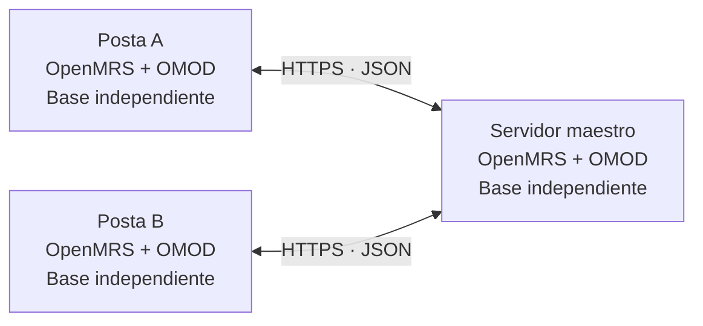

# SynchronizationMR · SIH.SALUS

**Sincronización de información clínica entre establecimientos con conectividad intermitente.**

SynchronizationMR es un módulo de OpenMRS desarrollado para el proyecto **SIH.SALUS**, en el contexto de la Microrred de Salud del Napo. Permite registrar información localmente y distribuirla entre un servidor maestro y las postas cuando el canal de comunicación está disponible.

El componente se distribuye como un archivo **OMOD** y se ejecuta dentro de OpenMRS. Trabaja con sus entidades nativas —pacientes, encuentros, observaciones y órdenes— y utiliza eventos persistentes para conservar los datos pendientes de transmisión.

> **Estado:** en desarrollo. La integración se valida en un laboratorio con tres instancias de OpenMRS, bases independientes y datos ficticios. La instalación en establecimientos reales corresponde a una etapa posterior del proyecto.

## Propósito

La atención local no debe depender de que otro establecimiento esté conectado. El módulo separa el registro clínico del intercambio por red: guarda los eventos en la base local y ejecuta la sincronización posteriormente.

Cuando se restablece el canal, el proceso retoma el intercambio desde las confirmaciones registradas. La recepción reconoce los reintentos para evitar crear nuevamente un registro que ya fue recibido.

## Arquitectura



Las postas inician los intercambios: envían sus eventos y consultan los que les faltan. El maestro conserva el origen de los datos y permite que otras postas los reciban. También puede generar registros propios. La comunicación entre postas pasa por el maestro.

Cada instalación conserva su base de datos. El intercambio ocurre mediante los servicios del módulo; no utiliza replicación directa de bases de datos ni requiere un motor de sincronización externo al proceso de OpenMRS.

## Capacidades de la versión actual

| Área | Funcionalidad implementada |
| --- | --- |
| **Pacientes** | Captura y recepción de altas con los datos de identificación, nombres, direcciones y atributos admitidos por el contrato. |
| **Encuentros** | Captura y recepción de encuentros, observaciones y grupos; conservación de la relación con la visita mediante una instantánea. |
| **Órdenes** | Creación de órdenes de examen y medicamento admitidas, con referencias a paciente, encuentro y metadatos clínicos. |
| **Resultados** | Incorporación de observaciones nuevas a encuentros previamente sincronizados mediante eventos `ADD_OBS`. |
| **Datos existentes** | Preparación explícita por lotes de pacientes, encuentros, órdenes y resultados anteriores que aún no tienen eventos publicados. |
| **Interrupciones** | Persistencia local de eventos, intercambio periódico y reintentos al recuperar la comunicación. |
| **Integridad** | Identidad de origen, secuencias por flujo, confirmaciones consecutivas y recepción idempotente. |
| **Comunicación** | JSON versionado sobre HTTPS, autenticación y comprobación de permisos e identidad del nodo remoto. |

Estas capacidades cubren los contratos y escenarios admitidos por esta versión. No equivalen a la sincronización de todas las entidades o de todos los cambios posibles en OpenMRS.

## Cómo funciona

1. **Captura.** El personal registra datos mediante los servicios habituales de OpenMRS. Los interceptores del módulo detectan las operaciones admitidas.
2. **Persistencia local.** El dato clínico y su evento se guardan en la misma transacción. El evento conserva origen, secuencia, UUID y una representación JSON.
3. **Comparación.** El proceso periódico consulta las confirmaciones del maestro y determina qué eventos enviar o recibir.
4. **Recepción.** El destino valida el mensaje y sus dependencias; guarda los datos, el evento y la confirmación dentro de una transacción.
5. **Continuación.** Los ciclos posteriores retoman los pendientes. Un reintento exacto se reconoce sin duplicar el registro.

El guardado local no espera una respuesta de red. Sí requiere una base local funcional, una configuración válida y contenido compatible con el contrato del módulo.

### Identidad entre nodos

Los identificadores numéricos internos de OpenMRS pueden diferir entre bases. El módulo conserva el **UUID clínico** y registra por separado el **origen y la secuencia de sincronización**. Las confirmaciones se gestionan por origen y flujo, sin asumir un contador global para toda la microrred.

La información de sincronización se almacena en tablas propias, creadas mediante Liquibase. El módulo utiliza los servicios nativos y ajustes específicos de importación para conservar los datos y sus relaciones.

## Organización del repositorio

```text
synchronizationmr/
├── pom.xml                     Proyecto Maven principal
├── api/
│   └── src/
│       ├── main/java/          Captura, servicios, DAO, contratos y clientes
│       ├── main/resources/     Configuración Spring y migraciones Liquibase
│       └── test/               Pruebas aisladas y de integración interna
└── omod/
    └── src/
        ├── main/java/          Servlets de sincronización
        ├── main/resources/     Descriptor del módulo OpenMRS
        └── test/               Pruebas de endpoints y autorización
```

Puntos de entrada para revisar la implementación:

- [Captura de eventos clínicos](synchronizationmr/api/src/main/java/org/openmrs/module/synchronizationmr/advice).
- [Servicios y persistencia](synchronizationmr/api/src/main/java/org/openmrs/module/synchronizationmr/api).
- [Contratos, clientes y programación](synchronizationmr/api/src/main/java/org/openmrs/module/synchronizationmr/sync).
- [Endpoints HTTP](synchronizationmr/omod/src/main/java/org/openmrs/module/synchronizationmr/web).
- [Migraciones de la base de datos](synchronizationmr/api/src/main/resources/liquibase.xml).

## Compilación

El proyecto utiliza Maven y compila contra la API de **OpenMRS Platform 2.4.2**, con destino de bytecode Java 8. El entorno de desarrollo y validación ha utilizado **JDK 21**; el POM incluye un perfil de compatibilidad para ejecutar las pruebas con JDK modernos.

Con Java y Maven disponibles en la terminal, ejecutar desde la raíz del repositorio:

```shell
cd synchronizationmr
mvn clean install
```

El paquete instalable se genera en:

```text
synchronizationmr/omod/target/synchronizationmr-1.0.0-SNAPSHOT.omod
```

`install` compila, ejecuta las pruebas, empaqueta el módulo e instala el artefacto en el repositorio Maven local. **No lo despliega automáticamente en las instancias OpenMRS.**

## Instalación y configuración

La incorporación del OMOD se realiza mediante **Administration → Manage Modules** o el procedimiento de instalación de módulos de la distribución utilizada. La compatibilidad debe comprobarse con la versión y los módulos de cada instalación.

Instalar el archivo no configura por sí solo la comunicación. Cada nodo necesita:

| Configuración | Finalidad |
| --- | --- |
| `server.id` | Identidad única del establecimiento. Debe definirse antes de capturar datos y conservarse una vez utilizados sus eventos. |
| `synchronizationmr.nodeRole` | Rol `MASTER` o `POSTA`. |
| Cuentas técnicas y permisos | Autorizar las operaciones locales y el intercambio entre nodos. |
| HTTPS y confianza de certificados | Proteger y autenticar el canal de comunicación. |
| Endpoints y programación | Activar el intercambio periódico de los flujos requeridos. |
| Metadatos compatibles | Resolver referencias a conceptos, ubicaciones, profesionales y demás catálogos utilizados. |

La configuración del proceso periódico se valida en [PatientSyncScheduleConfig](synchronizationmr/api/src/main/java/org/openmrs/module/synchronizationmr/sync/PatientSyncScheduleConfig.java). La preparación histórica se habilita explícitamente y se gestiona mediante [PatientPreparationScheduler](synchronizationmr/api/src/main/java/org/openmrs/module/synchronizationmr/sync/PatientPreparationScheduler.java).

Los endpoints del módulo son:

```text
/openmrs/moduleServlet/synchronizationmr/patientSync
/openmrs/moduleServlet/synchronizationmr/encounterSync
/openmrs/moduleServlet/synchronizationmr/orderSync
```

Las credenciales deben proporcionarse de forma protegida y mantenerse fuera del código y de los registros públicos. El aprovisionamiento y el arranque desatendido para instalaciones reales forman parte de la etapa posterior de despliegue.

## Validación

Se utilizan dos niveles complementarios:

- **Pruebas automatizadas:** casos aislados con dobles, integración con servicios OpenMRS y H2, migraciones y pruebas web con solicitudes simuladas. Comprueban captura, transacciones, contratos, dependencias, autorizaciones y reintentos.
- **Laboratorio con tres instancias:** un maestro y dos postas, bases MariaDB independientes y canal HTTPS con Nginx. Se han comprobado creación y distribución de datos, preparación de registros existentes y recuperación después de interrupciones controladas.

La ejecución documentada del **27/09/2026** completó **226 casos: 186 de API y 40 de OMOD**, sin fallos, errores ni omisiones. Este resultado corresponde a esa versión y batería; no representa cobertura del 100 % del código ni cumplimiento integral de todos los requisitos.

Para ejecutar las pruebas desde `synchronizationmr`:

```shell
mvn test
```

Los reportes se generan en `api/target/surefire-reports` y `omod/target/surefire-reports`. Las pruebas automatizadas no requieren levantar las tres instancias del laboratorio. Los ensayos multinodo son una validación separada.

## Alcance y evolución

El desarrollo actual se centra en creación, preparación de datos existentes y adición de resultados. Entre los trabajos pendientes se encuentran:

- Propagación general de modificaciones, cierre de visitas y otros cambios posteriores de estado.
- Auditoría completa por destino y resultado de operación, y consulta exacta por identidad de sincronización.
- Evaluación de desempeño y volumen bajo criterios definidos.
- Ampliación de contratos para contenidos clínicos que todavía no están admitidos.

La conciliación automática de pacientes creados de forma independiente y la distribución de profesionales o catálogos no están implementadas. Estos aspectos deben distinguirse de la recepción de registros que ya comparten una identidad compatible.

La integración desarrollada en el marco de la tesis se valida en **laboratorio**. La instalación en entornos reales, sus formularios y catálogos definitivos, la gestión operativa de credenciales y el arranque automático corresponden a trabajo posterior dentro del proyecto SIH.SALUS.

## Licencia

Consultar [LICENSE](LICENSE) y los avisos de licencia incluidos en los archivos fuente.
