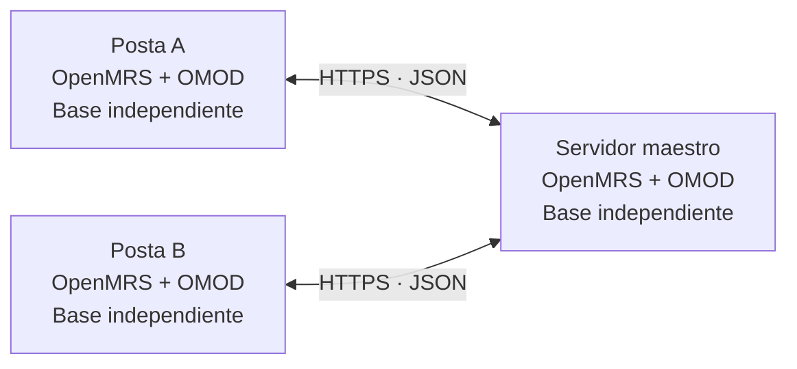

# SynchronizationMR · SIH.SALUS

**Sincronización de información clínica entre establecimientos con conectividad intermitente.**

SynchronizationMR es un módulo de OpenMRS desarrollado para el proyecto **SIH.SALUS**, en el contexto de la Microrred de Salud del Napo. Permite registrar información localmente y distribuirla entre un servidor maestro y las postas cuando el canal de comunicación está disponible.

El componente se distribuye como un archivo **OMOD** y se ejecuta dentro de OpenMRS. Trabaja con sus entidades nativas —pacientes, encuentros, observaciones y órdenes— y utiliza eventos persistentes para conservar los datos pendientes de transmisión.

> **Estado al 08/10/2026:** flujos clínicos implementados y probados dentro de los contratos admitidos; continúan la auditoría y las validaciones finales. La integración se valida en un laboratorio con tres instancias de OpenMRS, bases independientes y datos ficticios. La instalación en establecimientos reales corresponde a una etapa posterior del proyecto.

## Propósito

La atención local no debe depender de que otro establecimiento esté conectado. El módulo separa el registro clínico del intercambio por red: guarda los eventos en la base local y ejecuta la sincronización posteriormente.

Cuando se restablece el canal, el proceso retoma el intercambio desde las confirmaciones registradas. La recepción reconoce los reintentos para evitar crear nuevamente un registro que ya fue recibido.

## Arquitectura



Las postas inician los intercambios: envían sus eventos y consultan los que les faltan. El maestro conserva el origen de los datos y permite que otras postas los reciban. También puede generar registros propios. La comunicación entre postas pasa por el maestro.

Cada instalación conserva su base de datos. El intercambio ocurre mediante los servicios del módulo; no utiliza replicación directa de bases de datos ni requiere un motor de sincronización externo al proceso de OpenMRS.

## Capacidades de la versión actual

| Área | Funcionalidad implementada |
| --- | --- |
| **Pacientes** | Captura y recepción de altas con los datos de identificación, nombres, direcciones y atributos admitidos por el contrato. |
| **Modificaciones de pacientes** | Eventos UPDATE, identidad conservada y prevalencia del cambio más reciente por grupo de datos. Validado con pruebas automatizadas y ensayos de laboratorio dentro del alcance documentado. |
| **Encuentros** | Captura y recepción de encuentros, observaciones y grupos; conservación de la relación con la visita mediante una instantánea. |
| **Fechas y cierre de visitas** | `UPDATE_VISIT` para inicio/fin de visitas ya publicadas mediante encuentros. Intervalo versionado y conservación del historial. Cierre conectado, desconectado y recepción de encuentros pendientes tras el cierre comprobados en tres nodos. Reapertura comprobada en tres nodos; conflictos de intervalo con cobertura automatizada. |
| **Anulación de visitas** | `VOID_VISIT` para visitas publicadas mediante encuentros; cascada nativa sobre encuentros, observaciones y órdenes ya presentes, conservando historial. Verificado automáticamente y comprobado en tres nodos con encuentro y observaciones, con conexión y tras restablecer HTTPS. También comprobada la cascada sobre una orden de hemograma ya sincronizada y sus resultados, conservando valores y relaciones como historial anulado. También se verificó en los tres nodos que un encuentro pendiente de B, recibido por el maestro después de anular la visita, queda anulado con sus observaciones sin reactivar la visita. |
| **Datos y atributos de visita** | Actualización de tipo, ubicación, indicación y atributos de texto o conceptos con catálogos compatibles. Conserva el historial de atributos sustituidos y aplica la versión más reciente de la visita. Verificado automáticamente y en tres nodos para tipo, ubicación, incorporación, modificación y retirada de póliza y puntualidad por concepto; conflicto de puntualidad entre A y B sin conexión resuelto en tres nodos con la versión más reciente. |
| **Modificaciones de encuentros** | UPDATE de fecha, tipo, ubicación, formulario y profesionales asociados, con resolución de conflictos por campo. Validado automáticamente; pendiente de ensayo multinodo. |
| **Órdenes** | Creación de órdenes de examen y medicamento, revisiones, renovaciones y suspensiones mediante nuevas órdenes vinculadas. Comprobadas en laboratorio revisiones y suspensiones tras cortes HTTPS. Actualización del estado de cumplimiento, comentario y referencia mediante `UPDATE_FULFILLMENT`; comprobada en tres nodos al registrar resultados de hemograma con HTTPS disponible y de hemoglobina durante un corte, con entrega posterior al reconectar. |
| **Resultados y notas** | Incorporación mediante `ADD_OBS`, corrección de versiones mediante `CORRECT_OBS` y anulación de observaciones publicadas mediante `VOID_OBS`, conservando valores anteriores. Ediciones de Vitals y SOAP, conflictos entre cambios desconectados y corrección frente a anulación comprobados en tres nodos. |
| **Anulación de encuentros** | `VOID_ENCOUNTER` para encuentros publicados: anulación lógica con historial, cascada nativa y reintentos sin duplicados. Validado automáticamente y comprobado con notas SOAP entre tres nodos, con conexión disponible y entrega tras restablecer HTTPS. |
| **Datos existentes** | Preparación explícita por lotes de pacientes, encuentros, órdenes y resultados anteriores que aún no tienen eventos publicados. Comprobados pacientes y encuentros modificados antes de activar el módulo, y una orden creada y revisada con el módulo inactivo: se conserva su cadena y queda vigente la revisión. |
| **Interrupciones** | Persistencia local de eventos, intercambio periódico y reintentos al recuperar la comunicación. |
| **Consulta de sincronización (RF-14)** | Consulta entre nodos por tipo de entidad, origen y secuencia para identificar y recuperar los registros pendientes. |
| **Integridad** | Identidad de origen, secuencias por flujo, confirmaciones consecutivas y recepción idempotente. |
| **Comunicación** | JSON versionado sobre HTTPS, autenticación y comprobación de permisos e identidad del nodo remoto. |

Las revisiones y suspensiones concurrentes de una orden sobre el mismo predecesor se resuelven por la marca temporal más reciente, con desempate por origen, secuencia y UUID del evento. Las alternativas se conservan anuladas como historial. Se comprobaron entre nodos revisión frente a revisión y revisión frente a suspensión durante un corte HTTPS. Las renovaciones independientes no se concilian mediante esta regla.

Las órdenes pendientes recibidas después de una anulación publicada de su encuentro o visita se conservan como historial anulado, sin reactivar el contexto clínico. Este caso también se comprobó en las tres instancias.

Estas capacidades cubren los contratos y escenarios admitidos por esta versión. No equivalen a la sincronización de todas las entidades o de todos los cambios posibles en OpenMRS.

## Cómo funciona

1. **Captura.** El personal registra datos mediante los servicios habituales de OpenMRS. Los interceptores del módulo detectan las operaciones admitidas.
2. **Persistencia local.** El dato clínico y su evento se guardan en la misma transacción. El evento conserva origen, secuencia, UUID y una representación JSON.
3. **Comparación.** El proceso periódico consulta las confirmaciones del maestro y determina qué eventos enviar o recibir.
4. **Recepción.** El destino valida el mensaje y sus dependencias; guarda los datos, el evento y la confirmación dentro de una transacción.
5. **Continuación.** Los ciclos posteriores retoman los pendientes. Un reintento exacto se reconoce sin duplicar el registro.

El guardado local no espera una respuesta de red. Sí requiere una base local funcional, una configuración válida y contenido compatible con el contrato del módulo.

### Identidad entre nodos

Los identificadores numéricos internos de OpenMRS pueden diferir entre bases. El módulo conserva el **UUID clínico** y registra por separado el **origen y la secuencia de sincronización**. Las confirmaciones se gestionan por origen y flujo, sin asumir un contador global para toda la microrred.

La información de sincronización se almacena en tablas propias, creadas mediante Liquibase. El módulo utiliza los servicios nativos y ajustes específicos de importación para conservar los datos y sus relaciones.

## Organización del repositorio

```text
synchronizationmr/
├── pom.xml                     Proyecto Maven principal
├── api/
│   └── src/
│       ├── main/java/          Captura, servicios, DAO, contratos y clientes
│       ├── main/resources/     Configuración Spring y migraciones Liquibase
│       └── test/               Pruebas aisladas y de integración interna
└── omod/
    └── src/
        ├── main/java/          Servlets de sincronización
        ├── main/resources/     Descriptor del módulo OpenMRS
        └── test/               Pruebas de endpoints y autorización
```

Puntos de entrada para revisar la implementación:

- [Captura de eventos clínicos](synchronizationmr/api/src/main/java/org/openmrs/module/synchronizationmr/advice).
- [Servicios y persistencia](synchronizationmr/api/src/main/java/org/openmrs/module/synchronizationmr/api).
- [Contratos, clientes y programación](synchronizationmr/api/src/main/java/org/openmrs/module/synchronizationmr/sync).
- [Endpoints HTTP](synchronizationmr/omod/src/main/java/org/openmrs/module/synchronizationmr/web).
- [Migraciones de la base de datos](synchronizationmr/api/src/main/resources/liquibase.xml).

## Compilación

El proyecto utiliza Maven y compila contra la API de **OpenMRS Platform 2.4.2**, con destino de bytecode Java 8. El entorno de desarrollo y validación ha utilizado **JDK 21**; el POM incluye un perfil de compatibilidad para ejecutar las pruebas con JDK modernos.

Con Java y Maven disponibles en la terminal, ejecutar desde la raíz del repositorio:

```shell
cd synchronizationmr
mvn clean install
```

El paquete instalable se genera en:

```text
synchronizationmr/omod/target/synchronizationmr-1.0.0-SNAPSHOT.omod
```

`install` compila, ejecuta las pruebas, empaqueta el módulo e instala el artefacto en el repositorio Maven local. **No lo despliega automáticamente en las instancias OpenMRS.**

## Instalación y configuración

La incorporación del OMOD se realiza mediante **Administration → Manage Modules** o el procedimiento de instalación de módulos de la distribución utilizada. La compatibilidad debe comprobarse con la versión y los módulos de cada instalación.

Instalar el archivo no configura por sí solo la comunicación. Cada nodo necesita:

| Configuración | Finalidad |
| --- | --- |
| `server.id` | Identidad única del establecimiento. Debe definirse antes de capturar datos y conservarse una vez utilizados sus eventos. |
| `synchronizationmr.nodeRole` | Rol `MASTER` o `POSTA`. |
| Cuentas técnicas y permisos | Autorizar las operaciones locales y el intercambio entre nodos. |
| HTTPS y confianza de certificados | Proteger y autenticar el canal de comunicación. |
| Endpoints y programación | Activar el intercambio periódico de los flujos requeridos. |
| Metadatos compatibles | Resolver referencias a conceptos, ubicaciones, profesionales y demás catálogos utilizados. |

La configuración del proceso periódico se valida en [PatientSyncScheduleConfig](synchronizationmr/api/src/main/java/org/openmrs/module/synchronizationmr/sync/PatientSyncScheduleConfig.java). La preparación histórica se habilita explícitamente y se gestiona mediante [PatientPreparationScheduler](synchronizationmr/api/src/main/java/org/openmrs/module/synchronizationmr/sync/PatientPreparationScheduler.java).

Los endpoints del módulo son:

```text
/openmrs/moduleServlet/synchronizationmr/patientSync
/openmrs/moduleServlet/synchronizationmr/encounterSync
/openmrs/moduleServlet/synchronizationmr/orderSync
```

Las credenciales deben proporcionarse de forma protegida y mantenerse fuera del código y de los registros públicos. El aprovisionamiento y el arranque desatendido para instalaciones reales forman parte de la etapa posterior de despliegue.

## Validación

Se utilizan dos niveles complementarios:

- **Pruebas automatizadas:** casos aislados con dobles, integración con servicios OpenMRS y H2, migraciones y pruebas web con solicitudes simuladas. Comprueban captura, transacciones, contratos, dependencias, autorizaciones y reintentos.
- **Laboratorio con tres instancias:** un maestro y dos postas, bases MariaDB independientes y canal HTTPS con Nginx. Se han comprobado creación y distribución de datos, preparación de registros existentes y recuperación después de interrupciones controladas.

La última ejecución completa, del **08/10/2026**, terminó con **491 pruebas: 441 de API y 50 de OMOD**, sin fallos, errores ni omisiones. Incluye captura y recepción, conflictos, permisos, rollback, reintentos, datos históricos y órdenes recibidas después de una anulación. El conteo corresponde al paquete validado; no representa cobertura del 100 % del código ni aceptación de todos los requisitos.

En el laboratorio se comprobaron:

- Altas y modificaciones de pacientes; recuperación tras desconexión y conflictos entre ediciones.
- Preparación de pacientes y encuentros existentes con cambios anteriores a la activación del módulo.
- Registro, corrección y anulación de observaciones; conflictos de temperatura y notas SOAP, y cambios recibidos después de anular un encuentro.
- Cierre, reapertura, metadatos y atributos de visitas; conflictos de puntualidad y anulación con sus encuentros, observaciones y órdenes.
- Creación, revisión, renovación y suspensión de órdenes de medicamento; revisión y suspensión de órdenes de examen con desconexión.
- Resultados de hemograma y hemoglobina, junto con el estado de cumplimiento de la orden, con conexión y tras reconectar.
- Conflictos entre revisiones y suspensiones, y recepción de una orden pendiente cuya visita se había anulado.
- Preparación de una orden creada y revisada con el módulo inactivo: las tres bases conservan la original como historial y la revisión como vigente.

Las modificaciones de fecha, tipo, ubicación, formulario y profesionales del encuentro tienen cobertura automatizada; no se presentan como ensayos multinodo. Las pruebas de laboratorio no abarcan todos los formularios, combinaciones de conflictos ni desfases de reloj.

Para ejecutar las pruebas desde `synchronizationmr`:

```shell
mvn package
```

Los reportes se generan en `api/target/surefire-reports` y `omod/target/surefire-reports`. La fase `package` ejecuta las pruebas y genera el JAR de API que necesita el submódulo OMOD. Las pruebas automatizadas no requieren levantar las tres instancias del laboratorio. Los ensayos multinodo son una validación separada.

## Alcance y evolución

Los flujos implementados abarcan pacientes, encuentros, observaciones, visitas asociadas y órdenes dentro de los contratos descritos. La consulta interna por tipo de entidad, origen y secuencia cubre RF-14. La siguiente etapa de trabajo es **RF-15: auditoría por transacción**; los eventos y recibos existentes proporcionan trazabilidad básica, pero falta completar el registro por destino, fecha, entidad y resultado de la operación.

También quedan pendientes:

- Evaluación de desempeño y volumen bajo criterios definidos.
- Revisión final de seguridad, permisos y configuración de comunicación.
- Validación de instalación y actualización del OMOD desde Manage Modules y de su configuración operativa.

Los diagnósticos estructurados, Conditions, imágenes y otros contenidos no admitidos por los contratos actuales quedan fuera del alcance implementado. La anulación es lógica y conserva historial; no se ofrece borrado físico ni restauración de registros anulados. Las visitas se publican mediante sus encuentros, no como un flujo independiente de visitas vacías.

La conciliación automática de pacientes creados de forma independiente y la distribución de profesionales o catálogos no están implementadas. Estos aspectos deben distinguirse de la recepción de registros que ya comparten una identidad compatible.

Los UPDATE de encuentros requieren **`Edit Encounters`** en la cuenta receptora, además de los permisos de recepción y acceso a los catálogos utilizados. Deben actualizarse todos los nodos antes de probarlos. Los profesionales asociados se comparan como un conjunto; cada otro campo mantiene su propia versión. La recepción de metadatos no vuelve a ejecutar las correcciones automáticas que `saveEncounter` puede generar al cambiar fecha o ubicación: las versiones resultantes viajan por separado mediante `CORRECT_OBS`.

Las correcciones requieren **`Edit Observations`** y los permisos específicos del tipo de encuentro. Conservan los UUID de las versiones generadas en origen y el vínculo con la orden. Ante correcciones incompatibles de la misma observación, prevalece la versión mayor por fecha, origen, secuencia y UUID del evento. Las alternativas permanecen anuladas: sus valores y relaciones originales se conservan en el historial del módulo. Debido a la restricción nativa de un sucesor por observación, `previous_version` representa la cadena ganadora, no todas las ramas alternativas.

Este contrato admite hasta 100 versiones por evento y exige que la observación original ya esté publicada. Las anulaciones se transportan por separado mediante `VOID_OBS`: conservan valores y UUID, y no inventan vínculos entre observaciones que el formulario guardó sin `previous_version`. La preparación explícita permite publicar anulaciones pendientes de observaciones ya sincronizadas. No se incluyen restauraciones, borrados físicos ni archivos complejos. Una edición puede producir varios eventos, recibidos por separado; puede existir un estado intermedio hasta completar la entrega. La corrección de resultados no modifica ni cancela la orden que los solicitó.

La integración desarrollada en el marco de la tesis se valida en **laboratorio**. La instalación en entornos reales, sus formularios y catálogos definitivos, la gestión operativa de credenciales y el arranque automático corresponden a trabajo posterior dentro del proyecto SIH.SALUS.

## Licencia

Consultar [LICENSE](LICENSE) y los avisos de licencia incluidos en los archivos fuente.
